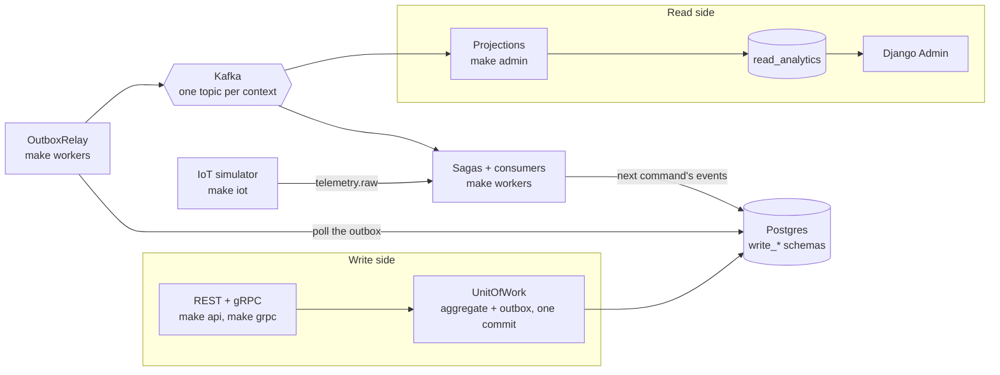

# 🌿 PlantKeeper

Event-driven plant care platform for a household plant collection, with simulated IoT
telemetry. One "household", several members, no authentication.

The project demonstrates **DDD + CQRS + Event Sourcing** on Python: a slow domain
(watering once a week) fed by a fast telemetry stream (a sensor reading every 10 seconds),
glued together with **Transactional Outbox**, **Idempotent Consumers**, **Sagas** and
**Kafka events** between bounded contexts.



The generated, always-current versions of this picture are
[`docs/diagrams/event-flow.md`](docs/diagrams/event-flow.md) (every event edge) and
[`docs/diagrams/sagas.md`](docs/diagrams/sagas.md) (the orchestration sagas' steps).

## Stack

| Layer | Technology |
|-------|------------|
| Write API (REST) | FastAPI + Pydantic v2 + Dishka |
| Write API (gRPC) | grpcio + grpcio-tools + protobuf |
| Read / Admin | ASGI Django + Django Admin |
| Event streaming | FastStream + Kafka (KRaft, no Zookeeper) |
| CQRS framework | `python-cqrs` |
| ORM (write) | SQLAlchemy 2.0 async + Alembic |
| ORM (read / admin) | Django ORM (`read_analytics` schema) |
| Cache | Valkey |
| IoT simulator | own Python service with a physical model |
| Tests | pytest + pytest-asyncio + testcontainers |
| Tooling | uv workspace, Ruff, Mypy (strict), pre-commit |

## Repository layout

```
packages/domain          # aggregates, value objects, domain events (pure, no I/O)
packages/application     # commands, queries, sagas, ports
packages/infrastructure  # persistence, messaging, external ACLs, cache, DI
apps/api                 # FastAPI REST + gRPC servicers
apps/admin               # ASGI Django read models
apps/workers             # FastStream consumers
tools/iot-simulator      # Kafka telemetry generator
proto/                   # gRPC definitions
tests/                   # unit, integration, e2e
docs/                    # architecture, domain, ADRs
```

## Quick start

Requirements: Python 3.14+, [uv](https://docs.astral.sh/uv/), Docker with Compose v2.

```bash
uv sync --all-packages    # install the workspace
make dev                  # start Kafka (KRaft), Postgres, Valkey, Redpanda Console
make migrate              # apply the schemas (Alembic write_*, Django read_analytics)
make api                  # FastAPI on http://localhost:8000 (OpenAPI at /docs)
make grpc                 # gRPC on localhost:50051 (Care + Garden; generates proto/ stubs)
make workers              # outbox relay + telemetry ingress + the sagas and their timers
make admin                # read side on http://localhost:8001/admin/ (projections + Django Admin)
make iot                  # the IoT simulator: 20 sensors into telemetry.raw
make lint                 # ruff + mypy + import-linter
make test                 # pytest
make coverage             # pytest + HTML report + the per-layer coverage floors
make contracts            # export OpenAPI/AsyncAPI and regenerate the Mermaid diagrams
make clean                # stop infra and drop volumes
```

The system runs as three processes on purpose. `make api` answers HTTP and commits
each command together with the events it produced into the outbox; `make grpc` is a
second, typed surface over the same application layer (see
[`docs/grpc.md`](docs/grpc.md)); `make workers` runs the relay that publishes those
events to Kafka, the write-side consumers (the telemetry ingress that turns
`telemetry.raw` into readings and events, the sagas, and the notification producers
and pusher), and their timers (the missed-care tick, the daily catalogue trigger,
saga recovery and the readings table's partition window); `make admin` consumes them
into the `read_analytics` schema and serves Django Admin over it. Nothing in either
API process talks to the broker, so a slow Kafka cannot slow a request down, and
nothing in the read side reads a write schema. See [`docs/events.md`](docs/events.md)
for the topic, header and key contract, [`docs/telemetry.md`](docs/telemetry.md) for
the raw stream and the readings table, [`docs/cqrs.md`](docs/cqrs.md) for the two
sides, [`docs/sagas.md`](docs/sagas.md) for the process managers,
[`docs/notifications.md`](docs/notifications.md) for HTTP long polling, and
[`docs/catalog.md`](docs/catalog.md) for the Trefle synchronisation and the
species cache.

A client receives its household's notifications by long-polling the write API; the
worker's `NotificationPusher` wakes it through Valkey, and the endpoint always
answers from the write tables:

```bash
curl -N "http://localhost:8000/api/v1/notifications/pending?household_id=<uuid>&timeout=30"
```

With `make grpc` running, the gRPC contract is discoverable through reflection:

```bash
grpcurl -plaintext localhost:50051 list
grpcurl -plaintext -d '{"household_id": {"value": "<household-uuid>"}}' \
  localhost:50051 plantkeeper.v1.CareService/GetTodayCare
```

`make iot` is only useful once a sensor has somewhere to report to: the simulator
prints the ids it generates, and readings from an unregistered sensor are dropped (with
a warning) because no plant owns them yet. Register one with
`POST /api/v1/sensors {"plant_id": "...", "sensor_id": "<the printed id>"}`, or read
[`docs/iot-simulator.md`](docs/iot-simulator.md) for the quicker path.

Local infrastructure endpoints:

| Service | Endpoint |
|---------|----------|
| Kafka | `localhost:9092` |
| Postgres | `localhost:5432` (database/user/password: `plantkeeper`) |
| Valkey | `localhost:6379` |
| Redpanda Console | <http://localhost:8080> |
| Write API (REST) | <http://localhost:8000> (OpenAPI at `/docs`) |
| Write API (gRPC) | `localhost:50051` (reflection enabled for grpcurl) |
| Django Admin (read side) | <http://localhost:8001/admin/> |

Connection settings are documented in `.env.example`.

## Contracts

The integration contract is generated from the code, never hand-written:

```bash
make contracts    # docs/openapi.json, docs/asyncapi-{write,read}.json, docs/diagrams/*.md
make diagrams     # only the two checked-in Mermaid diagrams
uv run python tools/contracts.py --check   # fail if a checked-in diagram is stale
```

`docs/openapi.json` is the document FastAPI serves at `/docs`, built without a running
process. The two AsyncAPI documents are built from the same broker registrations
`make workers` and `make admin` use; because the write side's producers are the outbox
relay rather than FastStream routes, each document carries the full event catalogue as
an `x-plantkeeper-event-catalogue` extension. The JSON documents are gitignored build
products (like the gRPC stubs); the Mermaid diagrams are committed so GitHub renders
them, and `tests/unit/contracts` plus `tests/unit/docs` fail when either drifts from
the code.

## Documentation

- [`ROADMAP.md`](ROADMAP.md) — phases, atomic tasks, Definition of Done
- [`docs/architecture.md`](docs/architecture.md) — bounded contexts, layers, data flow
- [`docs/patterns.md`](docs/patterns.md) — every pattern the platform uses, linked to its code
- [`docs/domain.md`](docs/domain.md) — ubiquitous language, aggregates, invariants
- [`docs/events.md`](docs/events.md) — event catalogue and its Kafka transport
- [`docs/grpc.md`](docs/grpc.md) — the gRPC services, message conventions, error statuses and grpcurl usage
- [`docs/telemetry.md`](docs/telemetry.md) — the raw `telemetry.raw` stream, the readings table and its partitions
- [`docs/iot-simulator.md`](docs/iot-simulator.md) — the simulator's physical model, scenarios and CLI
- [`docs/event-sourcing.md`](docs/event-sourcing.md) — the Journal's stream, snapshots and replay
- [`docs/cqrs.md`](docs/cqrs.md) — write schema, read schema, projections
- [`docs/sagas.md`](docs/sagas.md) — the four process managers, their compensations and their timers
- [`docs/notifications.md`](docs/notifications.md) — HTTP long polling, the Valkey presence channel and who creates which notification
- [`docs/catalog.md`](docs/catalog.md) — the Trefle anti-corruption layer, its circuit breaker, and the Valkey species cache
- [`docs/diagrams/`](docs/diagrams/) — the generated event-flow and saga diagrams
- [`docs/adr/`](docs/adr/) — architecture decision records
- [`CONTRIBUTING.md`](CONTRIBUTING.md) — branches, commits, local workflow
- [`CHANGELOG.md`](CHANGELOG.md) — release history
- [`AGENTS.md`](AGENTS.md) — guidance for AI coding agents

### Architecture decision records

| ADR | Decision |
|-----|----------|
| [0001](docs/adr/0001-record-architecture-decisions.md) | We record architecture decisions |
| [0002](docs/adr/0002-bounded-contexts.md) | Eight bounded contexts, seven with aggregates, communicating only through events |
| [0003](docs/adr/0003-write-side-outbox.md) | A hand-rolled transactional outbox and the write side's single producer |
| [0004](docs/adr/0004-read-side-projections.md) | The read side is Django, writing `read_analytics` through idempotent projections |
| [0005](docs/adr/0005-orchestration-vs-choreography.md) | Which sagas coordinate, and where saga state lives |
| [0006](docs/adr/0006-rest-and-grpc.md) | Two wire protocols over one application layer |
| [0007](docs/adr/0007-why-python-cqrs.md) | What we take from `python-cqrs` and what we own |
| [0008](docs/adr/0008-outbox-pattern.md) | The outbox as a whole pattern: producers, ledgers and offsets |
| [0009](docs/adr/0009-event-sourcing-journal.md) | Why the Journal is event-sourced, and how its stream is protected |

## Test coverage

`make coverage` runs the whole suite and then reports each layer against its floor:

| Layer | Floor | Current |
|-------|-------|---------|
| `plantkeeper.domain` | 90% | 100% |
| `plantkeeper.application` | 80% | 97% |
| `plantkeeper.infrastructure` | 70% | 96% |

The HTML report lands in the gitignored `docs/coverage.html`, and `make test` prints
the per-line report. The floors themselves live in this table and in the `coverage`
target — deliberately not as a global `fail_under`, which would fail `make test-unit`
for covering one layer at a time.

The platform has no application authentication: the REST API takes no tokens and
tracks no sessions, and no bounded context models a login. Django Admin is a local
read-only view, so it renders as a single superuser that
`plantkeeper.admin.dev_auth` selects automatically — there is no login form to
reach. Set `DJANGO_AUTO_LOGIN_USER=` (empty) in `.env` to disable that and use
Django's own login instead, creating the user once with:

```bash
uv run python apps/admin/manage.py createsuperuser
```

Django Admin's own tables (`auth_*`, `django_*`) live in the `public` schema and
exist because the admin framework needs them; the platform's read models live in
`read_analytics` and are written only by projections.
