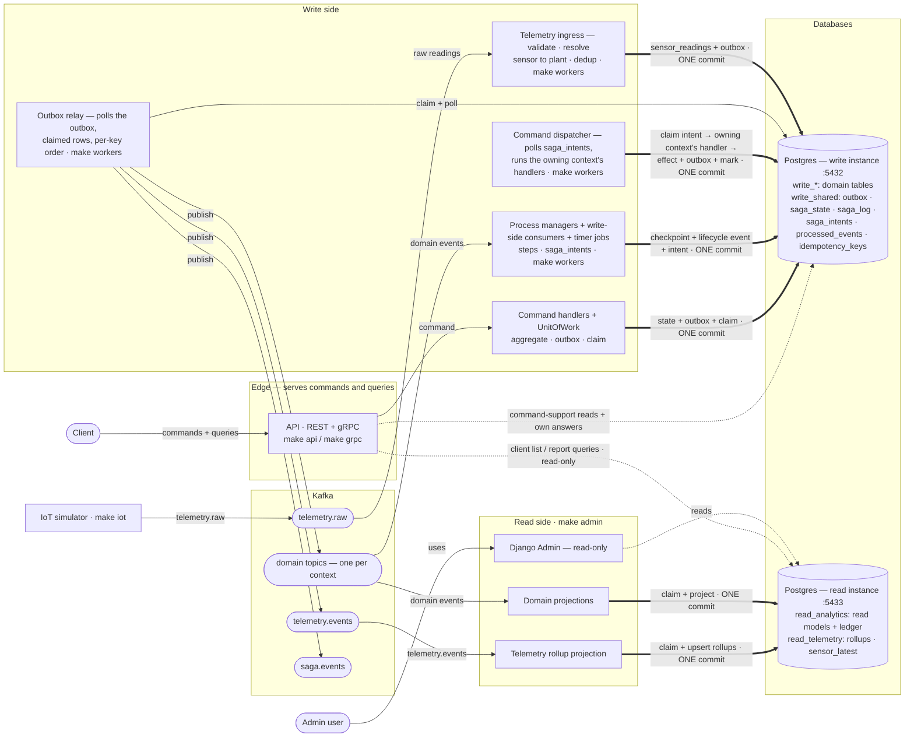

# 🌿 PlantKeeper

[](LICENSE.md)
[](https://www.python.org/downloads/)
[](https://docs.astral.sh/uv/)

Event-driven plant care platform for a household plant collection, with simulated IoT
telemetry. One "household", several members, no authentication.

The project demonstrates **DDD + CQRS + Event Sourcing** on Python: a slow domain
(watering once a week) fed by a fast telemetry stream (a sensor reading every 10 seconds),
glued together with **Transactional Outbox**, **Idempotent Consumers**, **Sagas** and
**Kafka events** between bounded contexts.


```mermaid
flowchart LR
  USER(["Client"])
  OPS(["Admin user"])
  IOT["IoT simulator · make iot"]

  subgraph entry ["Edge — serves commands and queries"]
    API["API · REST + gRPC<br/>make api / make grpc"]
  end

  subgraph write ["Write side"]
    UOW["Command handlers + UnitOfWork<br/>aggregate · outbox · claim"]
    SAGA["Process managers + write-side consumers + timer jobs<br/>steps · saga_intents · make workers"]
    DISPATCH["Command dispatcher — polls saga_intents,<br/>runs the owning context's handlers · make workers"]
    INGRESS["Telemetry ingress — validate · resolve<br/>sensor to plant · dedup · make workers"]
    RELAY["Outbox relay — polls the outbox,<br/>claimed rows, per-key order · make workers"]
  end

  subgraph dbs ["Databases"]
    PG[("Postgres — write instance :5432<br/>write_*: domain tables<br/>write_shared: outbox · saga_state · saga_log ·<br/>saga_intents · processed_events · idempotency_keys")]
    RDB[("Postgres — read instance :5433<br/>read_analytics: read models + ledger<br/>read_telemetry: rollups · sensor_latest")]
  end

  subgraph kafka ["Kafka"]
    T_DOM(["domain topics — one per context"])
    T_RAW(["telemetry.raw"])
    T_TELE(["telemetry.events"])
    T_SAGA(["saga.events"])
  end

  subgraph read ["Read side · make admin"]
    PROJ["Domain projections"]
    TELEPROJ["Telemetry rollup projection"]
    ADMIN["Django Admin — read-only"]
  end

  USER -->|"commands + queries"| API
  OPS -->|"uses"| ADMIN

  API -->|"command"| UOW
  API -.->|"command-support reads + own answers"| PG
  UOW ==>|"state + outbox + claim · ONE commit"| PG

  T_DOM -->|"domain events"| SAGA
  SAGA ==>|"checkpoint + lifecycle event + intent · ONE commit"| PG
  DISPATCH ==>|"claim intent → owning context's handler →<br/>effect + outbox + mark · ONE commit"| PG

  RELAY -->|"claim + poll"| PG
  RELAY -->|"publish"| T_DOM
  RELAY -->|"publish"| T_TELE
  RELAY -->|"publish"| T_SAGA

  IOT -->|"telemetry.raw"| T_RAW
  T_RAW -->|"raw readings"| INGRESS
  INGRESS ==>|"sensor_readings + outbox · ONE commit"| PG

  T_TELE -->|"telemetry.events"| TELEPROJ
  TELEPROJ ==>|"claim + upsert rollups · ONE commit"| RDB

  T_DOM -->|"domain events"| PROJ
  PROJ ==>|"claim + project · ONE commit"| RDB
  API -.->|"client list / report queries · read-only"| RDB
  ADMIN -.->|"reads"| RDB
```

Thick arrows are the writes that commit in a single transaction, dotted arrows are
reads, and plain arrows are message flow and relay claims. The sketch is hand-drawn
and is deliberately not test-guarded; the generated, always-current versions of it
are [`docs/diagrams/event-flow.md`](docs/diagrams/event-flow.md) (every event edge)
and [`docs/diagrams/sagas.md`](docs/diagrams/sagas.md) (the orchestration sagas'
steps); those two are rendered from the code and `tests/unit/docs` fails when they
drift.

## Key features

- **Eight bounded contexts with no shared internals.** No context imports another's
  internals and none calls another over the network, and the dependency rules are
  enforced by `import-linter` rather than by review. Between processes the only
  integration is Kafka events; inside the worker process an orchestration saga
  coordinates through the shared application layer, recording a command that the owning
  context executes rather than reaching into its tables.
- **Transactional outbox.** Every write commits the aggregate's new state and the events
  it raised in one transaction; a relay publishes them afterwards, so no request handler
  ever contacts the broker.
- **Idempotent consumers.** Each consumer claims a delivery in a ledger keyed by
  consumer group and event id, inside the same transaction as its work. The telemetry
  ingress is the one documented exception, deduplicated on the reading key instead.
- **CQRS read side on its own database.** Django projections write `read_analytics` and
  `read_telemetry` on a Postgres instance of their own, the client list and report
  queries are answered from them through a read-only engine, and a read model can be
  rebuilt by replaying its topic.
- **Event sourcing, deliberately in one place.** The Journal keeps one append-only stream
  per plant, with snapshots and "what was true on this date" reads.
- **Four process managers** — two orchestrated with per-step compensation (plant
  onboarding, catalogue synchronisation) and two choreographed (adaptive watering,
  missed care).
- **IoT telemetry** from a simulator with a physical model, five named scenarios and a
  reproducible seed; readings land in a month-partitioned table keyed by sensor and
  instant, are kept for a retention window, and roll up into `read_telemetry` for
  querying.
- **Notifications by Server-Sent Events**, woken by a payload-free per-household signal —
  a lost wake-up costs latency, never a message — with the request-and-wait endpoint kept
  as the fallback for clients that cannot stream.
- **Generated contracts.** OpenAPI, two AsyncAPI documents and the committed Mermaid
  diagrams are rendered from the code, and the test suite fails when one drifts.
- **Two protocols, one application layer.** REST and gRPC dispatch to the same command
  and query handlers over the same DI container.

## Stack

| Layer | Technology |
|-------|------------|
| Write API (REST) | FastAPI + Pydantic v2 + Dishka |
| Write API (gRPC) | grpcio + grpcio-tools + protobuf |
| Read / Admin | ASGI Django + Django Admin |
| Event streaming | FastStream + Kafka (KRaft, no Zookeeper) |
| CQRS framework | `python-cqrs` |
| ORM (write) | SQLAlchemy 2.0 async + Alembic |
| ORM (read / admin) | Django ORM (`read_analytics` and `read_telemetry` schemas), plus a read-only SQLAlchemy engine for the client queries |
| Cache | Valkey |
| IoT simulator | own Python service with a physical model |
| Tests | pytest + pytest-asyncio + testcontainers |
| Tooling | uv workspace, Ruff, Mypy (strict), pre-commit |

## Repository layout

```
packages/domain          # aggregates, value objects, domain events (pure, no I/O)
packages/application     # commands, queries, sagas, ports
packages/infrastructure  # persistence, messaging, external ACLs, cache, DI
apps/api                 # FastAPI REST + gRPC servicers
apps/admin               # ASGI Django read models
apps/workers             # FastStream consumers
tools/iot-simulator      # Kafka telemetry generator
proto/                   # gRPC definitions
tests/                   # unit, integration, e2e
docs/                    # architecture, domain, ADRs
```

## Quick start

Requirements: Python 3.14+, [uv](https://docs.astral.sh/uv/), Docker with Compose v2.

```bash
uv sync --all-packages    # install the workspace
make dev                  # start Kafka (KRaft), both Postgres instances, Valkey, Redpanda Console
make migrate              # apply the schemas (Alembic write_*, Django read_analytics + read_telemetry)
make api                  # FastAPI on http://localhost:8000 (OpenAPI at /docs)
make grpc                 # gRPC on localhost:50051 (Care + Garden; generates proto/ stubs)
make workers              # relay + dispatcher + telemetry ingress + the sagas and their timers
make admin                # read side on http://localhost:8001/admin/ (projections + Django Admin)
make iot                  # the IoT simulator: 20 sensors into telemetry.raw
make lint                 # ruff + mypy + import-linter
make test                 # pytest
make coverage             # pytest + HTML report + the per-layer coverage floors
make contracts            # export OpenAPI/AsyncAPI and regenerate the Mermaid diagrams
make clean                # stop infra and drop volumes
```

The system runs as three deployables on purpose. `make api` answers HTTP and commits
each command together with the events it produced into the outbox; `make grpc` is a
second, typed surface over the same application layer (see
[`docs/grpc.md`](docs/grpc.md)). `make workers` holds the whole write-side back end in
**one** process: the relay that publishes the outbox to Kafka, the eight write-side
consumer groups — the two orchestration triggers and the six choreography consumers
(the two choreography sagas, the journal recorder, the two notification consumers and
the catalogue cache's invalidator) — plus the telemetry ingress, a ninth group that
turns `telemetry.raw` into readings and events, and six background jobs (the
command dispatcher that executes a saga's recorded cross-context commands, the
missed-care tick, the daily catalogue trigger, saga recovery, the readings table's
partition window and retention, and the sensor silence timer). `make admin` is likewise
**one** process: the Kafka consumer that projects events into the `read_analytics` and
`read_telemetry` schemas, plus Django Admin served over them, so the read side is never
serving a stale page while its projections are down. Nothing in either API process talks
to the broker, so a slow Kafka cannot slow a request down, and nothing in the read side
reads a write schema. Which consumer subscribes to which topic is not written out by
hand here: the generated [`docs/diagrams/event-flow.md`](docs/diagrams/event-flow.md)
draws every edge from the code and a test fails when it drifts. See
[`docs/events.md`](docs/events.md)
for the topic, header and key contract, [`docs/telemetry.md`](docs/telemetry.md) for
the raw stream, the readings table and its read side, [`docs/cqrs.md`](docs/cqrs.md) for
the two sides, [`docs/sagas.md`](docs/sagas.md) for the process managers,
[`docs/notifications.md`](docs/notifications.md) for the notification stream, and
[`docs/catalog.md`](docs/catalog.md) for the Trefle synchronisation and the
species cache.

A client receives its household's notifications by opening a stream on the write API; the
worker's `NotificationPusher` wakes it through Valkey, and the content always comes from
the write tables. The request-and-wait form is kept as the fallback:

```bash
# Streaming (primary): resumes from the last notification the client saw
curl -N "http://localhost:8000/api/v1/notifications/stream?household_id=<uuid>&since=<notification-uuid>"

# Request and wait (fallback): answers at once if something is pending, else after the wait
curl -N "http://localhost:8000/api/v1/notifications/pending?household_id=<uuid>&timeout=30"
```

With `make grpc` running, the gRPC contract is discoverable through reflection:

```bash
grpcurl -plaintext localhost:50051 list
grpcurl -plaintext -d '{"household_id": {"value": "<household-uuid>"}}' \
  localhost:50051 plantkeeper.v1.CareService/GetTodayCare
```

`make iot` is only useful once a sensor has somewhere to report to: the simulator
prints the ids it generates, and readings from an unregistered sensor are dropped (with
a warning) because no plant owns them yet. Register one with
`POST /api/v1/sensors {"plant_id": "...", "sensor_id": "<the printed id>"}`, or read
[`docs/iot-simulator.md`](docs/iot-simulator.md) for the quicker path.

Local infrastructure endpoints:

| Service | Endpoint |
|---------|----------|
| Kafka | `localhost:9092` |
| Postgres — write instance | `localhost:5432` (database/user/password: `plantkeeper`) |
| Postgres — read instance | `localhost:5433` (database/user/password: `plantkeeper`) |
| Valkey | `localhost:6379` |
| Redpanda Console | <http://localhost:8080> |
| Write API (REST) | <http://localhost:8000> (OpenAPI at `/docs`) |
| Write API (gRPC) | `localhost:50051` (reflection enabled for grpcurl) |
| Django Admin (read side) | <http://localhost:8001/admin/> |

Connection settings are documented in `.env.example`. Kafka, both Postgres instances and
Valkey come from `make dev`; the API, worker and admin processes are started separately by
their own targets, and `make workers` has no endpoint of its own — it is a consumer and a
relay.

Telemetry reaches the read side too: a reading lives in `write_telemetry.sensor_readings`
for its retention window and travels on as `telemetry.events`, where the telemetry rollup
projection folds it into `read_telemetry` — a fixed-window rollup and a latest row per
sensor. The detailed readings are deliberately not copied into the domain read models, so
the raw table stays the detail record and the rollups stay rebuildable from the topic;
[`docs/telemetry.md`](docs/telemetry.md) has the shape and the rebuild.

## Contracts

The integration contract is generated from the code, never hand-written:

```bash
make contracts    # docs/openapi.json, docs/asyncapi-{write,read}.json, docs/diagrams/*.md
make diagrams     # only the two checked-in Mermaid diagrams
uv run python tools/contracts.py --check   # fail if a checked-in diagram is stale
```

`docs/openapi.json` is the document FastAPI serves at `/docs`, built without a running
process. The two AsyncAPI documents are built from the same broker registrations
`make workers` and `make admin` use; because the write side's producers are the outbox
relay rather than FastStream routes, each document carries the full event catalogue as
an `x-plantkeeper-event-catalogue` extension. That catalogue is generated once, in the
admin process — the only generator with Django configured, and therefore the only one
that can name both consumer sets — and handed to the worker's generator, so neither
document reports a read-side-only event as consumed by nobody. The JSON documents are
gitignored build products (like the gRPC stubs); the two generated Mermaid diagrams are
committed so GitHub renders them, and `tests/unit/contracts` plus `tests/unit/docs` fail
when either drifts from the code.

## Documentation

- [`docs/architecture.md`](docs/architecture.md) — bounded contexts, layers, data flow
- [`docs/patterns.md`](docs/patterns.md) — every pattern the platform uses, linked to its code
- [`docs/domain.md`](docs/domain.md) — ubiquitous language, aggregates, invariants
- [`docs/events.md`](docs/events.md) — event catalogue and its Kafka transport
- [`docs/grpc.md`](docs/grpc.md) — the gRPC services, message conventions, error statuses and grpcurl usage
- [`docs/telemetry.md`](docs/telemetry.md) — the raw `telemetry.raw` stream, the readings table, its retention and the telemetry read side
- [`docs/iot-simulator.md`](docs/iot-simulator.md) — the simulator's physical model, scenarios and CLI
- [`docs/event-sourcing.md`](docs/event-sourcing.md) — the Journal's stream, snapshots and replay
- [`docs/cqrs.md`](docs/cqrs.md) — write schema, the two read schemas, the query split and the projections
- [`docs/sagas.md`](docs/sagas.md) — the four process managers, their compensations, their recorded commands and their timers
- [`docs/notifications.md`](docs/notifications.md) — the notification stream and its request-and-wait fallback, the Valkey presence channel and who creates which notification
- [`docs/catalog.md`](docs/catalog.md) — the Trefle anti-corruption layer, its circuit breaker, and the Valkey species cache
- [`docs/diagrams/`](docs/diagrams/) — the generated event-flow and saga diagrams
- [`docs/adr/`](docs/adr/) — architecture decision records
- [`CONTRIBUTING.md`](CONTRIBUTING.md) — the change lifecycle, commit style and scopes, local workflow
- [GitHub Releases](https://github.com/DisMosGit/plantkeeper/releases) — where release notes are published
- [`AGENTS.md`](AGENTS.md) — guidance for AI coding agents

### Architecture decision records

| ADR | Decision |
|-----|----------|
| [0001](docs/adr/0001-record-architecture-decisions.md) | We record architecture decisions |
| [0002](docs/adr/0002-bounded-contexts.md) | Eight bounded contexts, seven with aggregates, communicating only through events |
| [0003](docs/adr/0003-write-side-outbox.md) | A hand-rolled transactional outbox and the write side's single producer |
| [0004](docs/adr/0004-read-side-projections.md) | The read side is Django, writing its read schemas on its own instance through idempotent projections |
| [0005](docs/adr/0005-orchestration-vs-choreography.md) | Which sagas coordinate, and where saga state lives |
| [0006](docs/adr/0006-rest-and-grpc.md) | Two wire protocols over one application layer |
| [0007](docs/adr/0007-why-python-cqrs.md) | What we take from `python-cqrs` and what we own |
| [0008](docs/adr/0008-outbox-pattern.md) | The outbox as a whole pattern: producers, ledgers and offsets |
| [0009](docs/adr/0009-event-sourcing-journal.md) | Why the Journal is event-sourced, and how its stream is protected |
| [0010](docs/adr/0010-message-provenance.md) | Provenance and schema version in the headers, and the accepted no-auth trust model |
| [0011](docs/adr/0011-consumer-failure-policy.md) | A consumer retries a delivery a bounded number of times, then moves it aside |
| [0012](docs/adr/0012-saga-command-dispatch.md) | A saga changes another context by recording a command, not by writing its tables |

## Changes and specifications

Planned work is tracked with [OpenSpec](https://github.com/Fission-AI/OpenSpec), under
[`openspec/`](openspec/):

- [`openspec/specs/`](openspec/specs/) — the project's capability specifications: what
  each part of the platform is required to do, written as testable requirements.
- [`openspec/changes/`](openspec/changes/) — the work in flight. Each change carries
  four artifacts: `proposal.md` (why and what), `specs/**/spec.md` (the requirements as
  deltas), `design.md` (the decisions) and `tasks.md` (the checklist).

A change moves through four steps: **propose** (write the artifacts, then
`openspec validate "<name>" --strict`), **review**, **implement** (work `tasks.md` one
task at a time, ticking each task in the commit that finishes it) and **archive**
(`openspec archive "<name>"` merges the deltas into `openspec/specs/`). The commands and
the working rules are in [`CONTRIBUTING.md`](CONTRIBUTING.md).

## Test coverage

`make coverage` runs the whole suite and then reports each layer against its floor:

| Layer | Floor | Current |
|-------|-------|---------|
| `plantkeeper.domain` | 90% | 100% |
| `plantkeeper.application` | 80% | 97% |
| `plantkeeper.infrastructure` | 70% | 96% |

The HTML report lands in the gitignored `docs/coverage.html`, and `make test` prints
the per-line report. The floors themselves live in this table and in the `coverage`
target — deliberately not as a global `fail_under`, which would fail `make test-unit`
for covering one layer at a time.

The platform has no application authentication: the REST API takes no tokens and
tracks no sessions, and no bounded context models a login. Django Admin is a local
read-only view, so it renders as a single superuser that
`plantkeeper.admin.dev_auth` selects automatically — there is no login form to
reach. Set `DJANGO_AUTO_LOGIN_USER=` (empty) in `.env` to disable that and use
Django's own login instead, creating the user once with:

```bash
uv run python apps/admin/manage.py createsuperuser
```

Django Admin's own tables (`auth_*`, `django_*`) live in the read instance's
`public` schema and exist because the admin framework needs them. The platform's
read models live in two schemas of that instance, each with its own Django
migration: `read_analytics` holds the domain read models and the consumer ledger
every projection claims a delivery in, and `read_telemetry` holds the telemetry
rollups and the latest row per sensor. Both are written only by projections.

## Contributing

[`CONTRIBUTING.md`](CONTRIBUTING.md) covers the change lifecycle, the commit style and
its scope list, and how to run everything locally. [`AGENTS.md`](AGENTS.md) states the
same rules for coding agents.

## License

[MIT](LICENSE.md).
