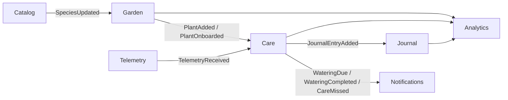

# Architecture

> **Status:** Phases 0–6 are implemented: the write path with its transactional
> outbox, the CQRS read side, the four sagas, the IoT simulator with its telemetry
> ingress, and the Journal as an event-sourced aggregate. Later phases add gRPC (7),
> long-polling notifications (8), the Trefle ACL (9) and the assembled contracts
> (10) — see [`ROADMAP.md`](../ROADMAP.md).

## Overview

PlantKeeper is an event-driven plant care platform built around one household, its
plants, and a stream of simulated IoT telemetry. The domain is deliberately split into
bounded contexts that communicate **only** through Kafka events: no bounded context
imports another context's internals, and there is no synchronous HTTP call between
contexts.

## Bounded contexts

| Context | Responsibility | Storage |
|---------|----------------|---------|
| Identity | Members of a household (no authentication) | `write_identity` |
| Catalog | Plant species, synchronised from Trefle | `write_catalog` + Valkey |
| Garden | Plants owned by the household | `write_garden` |
| Care | Watering schedules and their adaptation to telemetry | `write_care` |
| Journal | Append-only care log (event sourced) | `write_journal` |
| Telemetry | Ingestion and aggregation of sensor readings | `write_telemetry` |
| Notifications | Notifications delivered by HTTP long polling | `write_notifications` |
| Analytics | Read models for Django Admin and reports | `read_analytics` |

Event directions: Garden → Care → Journal → Analytics, Telemetry → Care, Catalog → Garden.

## Context map



*(Placeholder: the full context map with ACL and event-carried state transfer is
documented in Phase 10.)*## Layered architecture

```
domain          <- pure: aggregates, value objects, domain events. No I/O.
application     <- commands, queries, sagas, ports (Repository, UnitOfWork, EventPublisher).
infrastructure  <- SQLAlchemy, Kafka, Valkey, Trefle ACL, Dishka providers.
apps/*          <- FastAPI (REST + gRPC), ASGI Django admin, FastStream workers.
tools/iot-simulator <- independent simulator, publishes straight to Kafka.
```

The dependency direction is enforced mechanically by the `import-linter` contracts in
the root `pyproject.toml` (`make lint`).

## Write path

`HTTP / gRPC -> Command -> Aggregate -> SQLAlchemy -> Outbox -> Kafka`

Every write use case runs inside a Unit of Work, and the domain events it produces are
written to the `outbox` table **in the same transaction** as the aggregate. A relay
publishes them to Kafka and marks them as sent.

The arrow is split across two processes: `apps/api` stops at the commit, and the relay
in `apps/workers` owns every produce. That way a slow or unreachable broker delays
publication instead of an HTTP response, and the "aggregate and event are written
together" promise stays a property of one transaction rather than a convention. The
message contract — one topic per context, `event_name`/`event_id` headers, an
aggregate-derived key, at-least-once delivery and the dead-letter path — is in
[`docs/events.md`](events.md); the reasoning behind the outbox is in
[ADR 0003](adr/0003-write-side-outbox.md).

## Read path

`Kafka -> projection consumer -> read_analytics -> Django Admin / REST queries`

Consumers are idempotent on `(consumer_group, event_id)`, so at-least-once delivery does
not produce duplicates.

## Telemetry path

`IoT simulator -> telemetry.raw -> telemetry ingress -> sensor_readings + outbox -> relay -> telemetry.events -> AdaptiveWateringSaga`

The simulator in `tools/iot-simulator` is a producer of raw measurements, not of domain
events: it knows nothing about plants, so `telemetry.raw` carries
`sensor_id`/`recorded_at`/`moisture`/`temperature`/`light` and nothing else. The write
side's **telemetry ingress** (`plantkeeper.application.telemetry`, subscribed by
`apps/workers`) does what the simulator cannot:

1. validates the raw document against the domain's own value objects;
2. resolves `sensor_id -> plant_id` through the sensor registry, and drops a reading
   from a sensor nobody registered;
3. stores the reading in the partition-by-month `write_telemetry.sensor_readings`,
   whose `(sensor_id, recorded_at)` key is the idempotency that a redelivery or a
   replay cannot break;
4. appends the `TelemetryReceived` a newly stored reading produces to the transactional
   outbox, in the same transaction — so the saga's input arrives on the same
   at-least-once, one-writer path as every other domain event, and a redelivery that
   inserts no row announces nothing either.

`docs/telemetry.md` holds the envelope, the partitioning scheme and the runbook;
`docs/iot-simulator.md` holds the model and the CLI.

## Local topology

| Service | Endpoint | Provided by |
|---------|----------|-------------|
| Kafka (KRaft, no Zookeeper) | `localhost:9092` | `docker-compose.yml` |
| Postgres 18 | `localhost:5432` | `docker-compose.yml` |
| Valkey 9 | `localhost:6379` | `docker-compose.yml` |
| Redpanda Console | <http://localhost:8080> | `docker-compose.yml` |

`make dev` starts the stack and waits for every service to report healthy.

## References

- [`docs/domain.md`](domain.md) — ubiquitous language, aggregates, invariants
- [`docs/events.md`](events.md) — the event catalogue and its transport
- [`docs/cqrs.md`](cqrs.md) — the read side's projections
- [`docs/sagas.md`](sagas.md) — the four process managers
- [`docs/telemetry.md`](telemetry.md) — the raw envelope and the readings table
- [`docs/iot-simulator.md`](iot-simulator.md) — the physical model and the CLI
- [`docs/adr/`](adr/) — architecture decision records
- [`ROADMAP.md`](../ROADMAP.md) — phases and their Definition of Done
