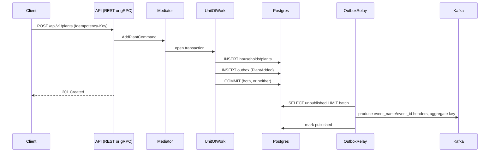
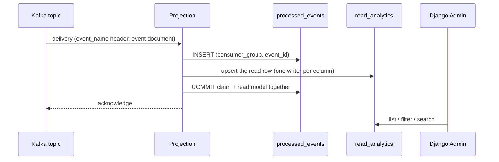
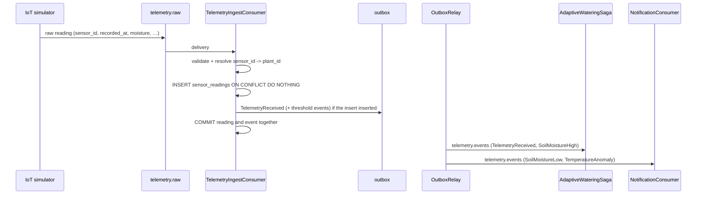

# Architecture

> **Status:** every phase is implemented. The write path with its transactional
> outbox, the CQRS read side, the four sagas, the IoT simulator with its telemetry
> ingress, the Journal as an event-sourced aggregate, the gRPC surface over the same
> application layer, notifications delivered by HTTP long polling, and the Trefle
> catalogue synchronisation with its circuit breaker and Valkey cache. The generated
> contracts and diagrams are Phase 10 — see [`ROADMAP.md`](../ROADMAP.md) and
> [`docs/patterns.md`](patterns.md).

## Overview

PlantKeeper is an event-driven plant care platform built around one household, its
plants, and a stream of simulated IoT telemetry. The domain is deliberately split into
bounded contexts that communicate **only** through Kafka events: no bounded context
imports another context's internals, and there is no synchronous HTTP call between
contexts. The one external call — Trefle, for species data — is wrapped in an
anti-corruption layer with a circuit breaker and a cache.

## Bounded contexts

| Context | Responsibility | Storage |
|---------|----------------|---------|
| Identity | Members of a household (no authentication) | `write_identity` |
| Catalog | Plant species, synchronised from Trefle | `write_catalog` + Valkey |
| Garden | Plants owned by the household | `write_garden` |
| Care | Watering schedules and their adaptation to telemetry | `write_care` |
| Journal | Append-only care log (event sourced) | `write_journal` |
| Telemetry | Ingestion and aggregation of sensor readings | `write_telemetry` |
| Notifications | Notifications delivered by HTTP long polling | `write_notifications` |
| Analytics | Read models for Django Admin and reports | `read_analytics` |
| — (shared) | Outbox, idempotency keys, saga state, the consumer ledger | `write_shared` |

Seven contexts have aggregates and events; Analytics is the read-side context, and
`write_shared` is the cross-cutting infrastructure every write context uses. The
independence of the seven is enforced mechanically by the `independence` contract in
the root [`pyproject.toml`](../pyproject.toml), so a cross-context import fails
`make lint`. Why the split is what it is: [ADR 0002](adr/0002-bounded-contexts.md).

## Context map

Which context publishes which fact, and who reacts to it. The full edge set with every
event of the catalogue is generated into
[`docs/diagrams/event-flow.md`](diagrams/event-flow.md); the summary below is the
same map in prose.

| From | Event(s) | To | Through |
|------|----------|----|---------|
| Garden | `PlantAdded`, `PlantOnboarded` | Care | `OnboardPlantSaga` creates the schedule and the first reminder |
| Garden | `PlantAdded`, `PlantMoved`, `PlantOnboarded`, `PlantRemoved` | Analytics | `GardenProjection` |
| Care | `WateringCompleted` | Journal | `JournalEntryConsumer` appends the entry |
| Care | `WateringCompleted`, `WateringDue`, `WateringRescheduled`, `CareMissed`, `CareSkipped` | Analytics | `CareProjection` |
| Care | `WateringDue`, `WateringRescheduled`, `CareMissed` | Notifications | `NotificationConsumer` |
| Telemetry | `TelemetryReceived`, `SoilMoistureHigh` | Care | `AdaptiveWateringSaga` moves the schedule |
| Telemetry | `SoilMoistureLow`, `TemperatureAnomaly` | Notifications | `NotificationConsumer` |
| Catalog | `SpeciesAdded`, `SpeciesUpdated` | Analytics | `SpeciesProjection`; the onboarding saga reads the catalogue through its own port, not by consuming this event |
| Catalog | `SpeciesUpdated`, `SpeciesCacheInvalidated` | Catalog (cache) | `SpeciesCacheConsumer` drops the Valkey keys |
| Notifications | `NotificationCreated` | Notifications (delivery) | `NotificationPusher` wakes the household's long poll |
| Notifications | `NotificationCreated`, `NotificationRead` | Analytics | `NotificationProjection` |
| Journal | `JournalEntryAdded` | Analytics | `JournalProjection` |
| any saga | `SagaStarted`, `SagaCompleted`, `SagaFailed`, `SagaCompensated` | observability | `saga.events`; no read model projects them |

Telemetry's own facts have no read model: no projection consumes `telemetry.events`, so
`SensorOffline` — the one event without a producer — has no consumer either. Both facts
are recorded in `docs/events.md` and [`docs/telemetry.md`](telemetry.md) as limits of
the telemetry context rather than as gaps to be filled silently.

Event-carried state transfer, not a shared database: a context that needs another's
fact subscribes to it (`docs/events.md`). The one request/response conversation is the
catalogue lookup the onboarding saga performs through `SpeciesCatalog`, which is a
local read of `write_catalog` rather than a call into another context's code.

## Layered architecture

```
domain          <- pure: aggregates, value objects, domain events. No I/O.
application     <- commands, queries, sagas, ports (Repository, UnitOfWork, EventPublisher).
infrastructure  <- SQLAlchemy, Kafka, Valkey, Trefle ACL, Dishka providers.
apps/*          <- FastAPI (REST + gRPC), ASGI Django admin, FastStream workers.
tools/iot-simulator <- independent simulator, publishes straight to Kafka.
```

The dependency direction is enforced mechanically by the `import-linter` contracts in
the root `pyproject.toml` (`make lint`).

## Write path

`HTTP / gRPC -> Command -> Aggregate -> SQLAlchemy -> Outbox -> Kafka`

Every write use case runs inside a Unit of Work, and the domain events it produces are
written to the `outbox` table **in the same transaction** as the aggregate. A relay
publishes them to Kafka and marks them as sent.



The arrow is split across two processes: `apps/api` stops at the commit, and the relay
in `apps/workers` owns every produce. That way a slow or unreachable broker delays
publication instead of an HTTP response, and the "aggregate and event are written
together" promise stays a property of one transaction rather than a convention. The
message contract — one topic per context, `event_name`/`event_id` headers, an
aggregate-derived key, at-least-once delivery and the dead-letter path — is in
[`docs/events.md`](events.md); the reasoning behind the outbox is in
[ADR 0003](adr/0003-write-side-outbox.md) and [ADR 0008](adr/0008-outbox-pattern.md).

## Read path

`Kafka -> projection consumer -> read_analytics -> Django Admin / REST queries`



Consumers are idempotent on `(consumer_group, event_id)`, so at-least-once delivery
does not produce duplicates, and a group rebuilt with an empty ledger replays the
topic safely. Rebuilding a read model is dropping its group and its ledger rows —
[`docs/cqrs.md`](cqrs.md) holds the procedure, [ADR 0004](adr/0004-read-side-projections.md)
the reasoning.

## Telemetry path

`IoT simulator -> telemetry.raw -> telemetry ingress -> sensor_readings + outbox -> relay -> telemetry.events -> AdaptiveWateringSaga`



The simulator in `tools/iot-simulator` is a producer of raw measurements, not of domain
events: it knows nothing about plants, so `telemetry.raw` carries
`sensor_id`/`recorded_at`/`moisture`/`temperature`/`light` and nothing else. The write
side's **telemetry ingress** (`plantkeeper.application.telemetry`, subscribed by
`apps/workers`) does what the simulator cannot:

1. validates the raw document against the domain's own value objects;
2. resolves `sensor_id -> plant_id` through the sensor registry, and drops a reading
   from a sensor nobody registered;
3. stores the reading in the partition-by-month `write_telemetry.sensor_readings`,
   whose `(sensor_id, recorded_at)` key is the idempotency that a redelivery or a
   replay cannot break;
4. appends the `TelemetryReceived` a newly stored reading produces to the transactional
   outbox, in the same transaction — so the saga's input arrives on the same
   at-least-once, one-writer path as every other domain event, and a redelivery that
   inserts no row announces nothing either;
5. hands the reading to `Sensor.record`, which raises `SoilMoistureLow`,
   `SoilMoistureHigh` and `TemperatureAnomaly` by threshold — the three events that
   were in the catalogue before they had a producer.

`docs/telemetry.md` holds the envelope, the partitioning scheme and the runbook;
`docs/iot-simulator.md` holds the model and the CLI.

## Saga path

`garden.events -> OnboardPlantTrigger -> OnboardPlantSaga -> write_care + write_notifications + outbox`

The two orchestration sagas run their steps through `python-cqrs`' engine with
per-step compensation; the two choreography sagas are ordinary consumers. Their real
step sequences are generated into [`docs/diagrams/sagas.md`](diagrams/sagas.md) from
the step lists, so the diagram cannot describe a sequence the code does not have.
Which shape fits which saga, and where saga state lives, is
[ADR 0005](adr/0005-orchestration-vs-choreography.md); the runbook is
[`docs/sagas.md`](sagas.md).

## Contract generation

| Artefact | Source | Command |
|----------|--------|---------|
| `docs/openapi.json` | `plantkeeper.api.main.create_app()` | `make contracts` |
| `docs/asyncapi-read.json` | the admin's projection routes + the event catalogue | `make contracts` |
| `docs/asyncapi-write.json` | the worker's broker routes + the admin's catalogue | `make contracts` |
| `docs/diagrams/event-flow.md` | `EVENT_TOPICS` + both consumer registries | `make diagrams` |
| `docs/diagrams/sagas.md` | `SAGA_TYPES` and each saga's step list | `make diagrams` |

The documents are derived from the code that implements them: the AsyncAPI documents
are built from the same broker registrations the two processes use, and the diagrams
from the registries the worker and the admin subscribe with.

The producers the relay owns are not FastStream routes, so they travel in the documents
as the `x-plantkeeper-event-catalogue` extension — and that extension is built *once*,
by `plantkeeper.admin.asyncapi`. Describing the platform's consumers means naming both
sets, which means importing Django, which neither `plantkeeper.infrastructure` nor the
worker's generator may do. `make contracts` therefore runs the admin generator first
and passes its document to the worker's with `--catalogue-from`; the same process writes
the diagrams, so they can draw the read side's edges too.

`uv run python tools/contracts.py --check` fails when a checked-in artefact no longer
matches the code; the tests in `tests/unit/docs` and `tests/unit/contracts` do the same
during `make test`.

## Local topology

| Service | Endpoint | Provided by |
|---------|----------|-------------|
| Kafka (KRaft, no Zookeeper) | `localhost:9092` | `docker-compose.yml` |
| Postgres 18 | `localhost:5432` | `docker-compose.yml` |
| Valkey 9 | `localhost:6379` | `docker-compose.yml` |
| Redpanda Console | <http://localhost:8080> | `docker-compose.yml` |
| Write API (REST) | <http://localhost:8000> | `make api` |
| Write API (gRPC) | `localhost:50051` | `make grpc` |
| Django Admin (read side) | <http://localhost:8001/admin/> | `make admin` |
| Write-side worker | — | `make workers` |
| IoT simulator | — | `make iot` |

`make dev` starts the stack and waits for every service to report healthy.

## References

- [`docs/patterns.md`](patterns.md) — every pattern the platform uses, and where it lives
- [`docs/domain.md`](domain.md) — ubiquitous language, aggregates, invariants
- [`docs/events.md`](events.md) — the event catalogue and its transport
- [`docs/cqrs.md`](cqrs.md) — the read side's projections
- [`docs/sagas.md`](sagas.md) — the four process managers
- [`docs/event-sourcing.md`](event-sourcing.md) — the Journal's stream and its replay
- [`docs/telemetry.md`](telemetry.md) — the raw envelope and the readings table
- [`docs/iot-simulator.md`](iot-simulator.md) — the physical model and the CLI
- [`docs/grpc.md`](grpc.md) — the gRPC services and the error table
- [`docs/notifications.md`](notifications.md) — HTTP long polling
- [`docs/catalog.md`](catalog.md) — the Trefle ACL, breaker and cache
- [`docs/adr/`](adr/) — architecture decision records
- [`ROADMAP.md`](../ROADMAP.md) — phases and their Definition of Done
