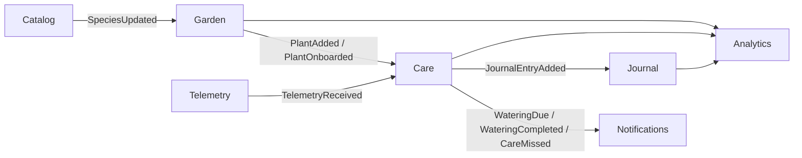

# Architecture

> **Status:** Phase 0 skeleton. The structure and the decisions behind it are recorded
> here; the diagrams and the detail are filled in by the phases that implement them —
> see [`ROADMAP.md`](../ROADMAP.md).

## Overview

PlantKeeper is an event-driven plant care platform built around one household, its
plants, and a stream of simulated IoT telemetry. The domain is deliberately split into
bounded contexts that communicate **only** through Kafka events: no bounded context
imports another context's internals, and there is no synchronous HTTP call between
contexts.

## Bounded contexts

| Context | Responsibility | Storage |
|---------|----------------|---------|
| Identity | Members of a household (no authentication) | `write_identity` |
| Catalog | Plant species, synchronised from Trefle | `write_catalog` + Valkey |
| Garden | Plants owned by the household | `write_garden` |
| Care | Watering schedules and their adaptation to telemetry | `write_care` |
| Journal | Append-only care log (event sourced) | `write_journal` |
| Telemetry | Ingestion and aggregation of sensor readings | `write_telemetry` |
| Notifications | Notifications delivered by HTTP long polling | `write_notifications` |
| Analytics | Read models for Django Admin and reports | `read_analytics` |

Event directions: Garden → Care → Journal → Analytics, Telemetry → Care, Catalog → Garden.

## Context map



*(Placeholder: the full context map with ACL and event-carried state transfer is
documented in Phase 10.)*

## Layered architecture

```
domain          <- pure: aggregates, value objects, domain events. No I/O.
application     <- commands, queries, sagas, ports (Repository, UnitOfWork, EventPublisher).
infrastructure  <- SQLAlchemy, Kafka, Valkey, Trefle ACL, Dishka providers.
apps/*          <- FastAPI (REST + gRPC), ASGI Django admin, FastStream workers.
tools/iot-simulator <- independent simulator, publishes straight to Kafka.
```

The dependency direction is enforced mechanically by the `import-linter` contracts in
the root `pyproject.toml` (`make lint`).

## Write path

`HTTP / gRPC -> Command -> Aggregate -> SQLAlchemy -> Outbox -> Kafka`

Every write use case runs inside a Unit of Work, and the domain events it produces are
written to the `outbox` table **in the same transaction** as the aggregate. A relay
publishes them to Kafka and marks them as sent.

## Read path

`Kafka -> projection consumer -> read_analytics -> Django Admin / REST queries`

Consumers are idempotent on `(consumer_group, event_id)`, so at-least-once delivery does
not produce duplicates.

## Local topology

| Service | Endpoint | Provided by |
|---------|----------|-------------|
| Kafka (KRaft, no Zookeeper) | `localhost:9092` | `docker-compose.yml` |
| Postgres 18 | `localhost:5432` | `docker-compose.yml` |
| Valkey 9 | `localhost:6379` | `docker-compose.yml` |
| Redpanda Console | <http://localhost:8080> | `docker-compose.yml` |

`make dev` starts the stack and waits for every service to report healthy.

## References

- [`docs/domain.md`](domain.md) — ubiquitous language, aggregates, invariants
- [`docs/adr/`](adr/) — architecture decision records
- [`ROADMAP.md`](../ROADMAP.md) — phases and their Definition of Done
