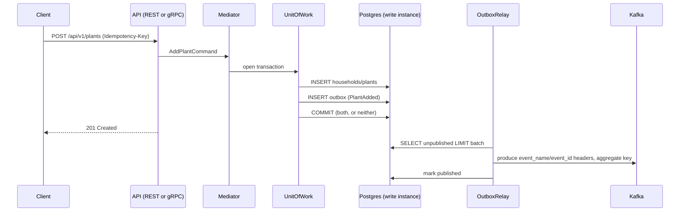
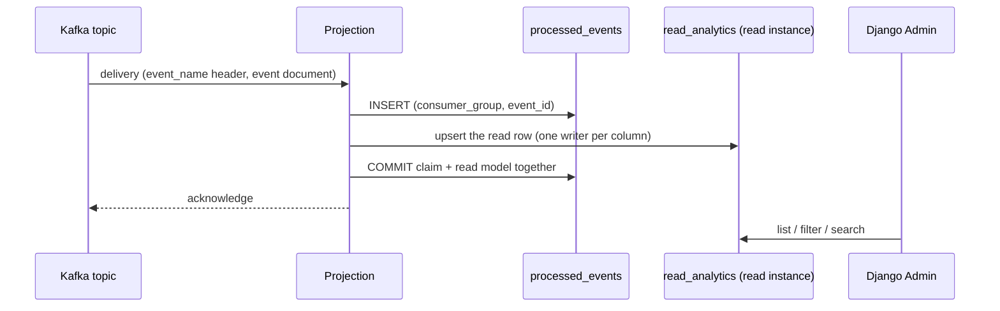
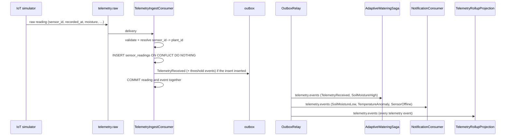

# Architecture

> **Status:** every phase is implemented. The write path with its transactional
> outbox, the CQRS read side on its own database, the four sagas and the dispatcher
> that runs their recorded cross-context commands, the IoT simulator with its telemetry
> ingress and telemetry read side, the Journal as an event-sourced aggregate, the gRPC
> surface over the same application layer, notifications delivered by a stream with the
> request-and-wait form as fallback, and the Trefle catalogue synchronisation with its
> circuit breaker and Valkey cache. The generated contracts and diagrams are documented
> in [`docs/patterns.md`](patterns.md).

## Overview

PlantKeeper is an event-driven plant care platform built around one household, its
plants, and a stream of simulated IoT telemetry. The domain is deliberately split into
bounded contexts that share no internals: no bounded context imports another context's
internals, none calls another context over the network, and none reads another context's
tables. **Across processes the only integration is events.** Within the worker process an
orchestration saga coordinates through the shared application layer: it commits its own
progress and a recorded command in one transaction, and a dispatcher executes that
command through the owning context's own handlers, so a process manager asks rather than
writes ([ADR 0012](adr/0012-saga-command-dispatch.md)). A step that needs another
context's data during the step reads it through the port that context defines — the one
such read is recorded below. The one external call — Trefle, for species data — is
wrapped in an anti-corruption layer with a circuit breaker and a cache.

## Bounded contexts

| Context | Responsibility | Storage |
|---------|----------------|---------|
| Identity | Members of a household (no authentication) | `write_identity` |
| Catalog | Plant species, synchronised from Trefle | `write_catalog` + Valkey |
| Garden | Plants owned by the household | `write_garden` |
| Care | Watering schedules and their adaptation to telemetry | `write_care` |
| Journal | Append-only care log (event sourced) | `write_journal` |
| Telemetry | Ingestion and aggregation of sensor readings | `write_telemetry` |
| Notifications | Notifications delivered by a stream, or by request and wait | `write_notifications` |
| Analytics | Read models for Django Admin and reports | `read_analytics` and `read_telemetry` (the read instance) |
| — (shared) | Outbox, idempotency keys, saga state, the consumer ledger | `write_shared` |

Seven contexts have aggregates and events; Analytics is the read-side context, and
`write_shared` is the cross-cutting infrastructure every write context uses. The
independence of the seven is enforced mechanically by the `independence` contract in
the root [`pyproject.toml`](../pyproject.toml), so a cross-context import fails
`make lint`. Why the split is what it is: [ADR 0002](adr/0002-bounded-contexts.md).

## Context map

Which context publishes which fact, and who reacts to it. The full edge set with every
event of the catalogue is generated into
[`docs/diagrams/event-flow.md`](diagrams/event-flow.md); the summary below is the
same map in prose.

| From | Event(s) | To | Through |
|------|----------|----|---------|
| Garden | `PlantAdded`, `PlantOnboarded` | Care | `OnboardPlantSaga` records the schedule command, then `CommandDispatcher` executes it through Care's own handler |
| Garden | `PlantAdded`, `PlantMoved`, `PlantOnboarded`, `PlantRemoved` | Analytics | `GardenProjection` |
| Garden | `PlantAdded`, `PlantMoved`, `PlantRemoved` | Journal | `JournalEntryConsumer` maintains the journal's own reference row |
| Garden | `PlantAdded`, `PlantMoved`, `PlantRemoved` | Notifications | `NotificationConsumer` maintains its own reference row |
| Care | `WateringCompleted` | Journal | `JournalEntryConsumer` appends the entry |
| Care | `WateringCompleted`, `WateringDue`, `WateringRescheduled`, `CareMissed`, `CareSkipped` | Analytics | `CareProjection` |
| Care | `WateringDue`, `WateringRescheduled`, `CareMissed` | Notifications | `NotificationConsumer` |
| Telemetry | `TelemetryReceived`, `SoilMoistureHigh` | Care | `AdaptiveWateringSaga` moves the schedule |
| Telemetry | `SoilMoistureLow`, `TemperatureAnomaly`, `SensorOffline` | Notifications | `NotificationConsumer` |
| Telemetry | `TelemetryReceived`, `SoilMoistureLow`, `SoilMoistureHigh`, `TemperatureAnomaly`, `SensorOffline` | Analytics | `TelemetryRollupProjection` writes `read_telemetry` |
| Catalog | `SpeciesAdded`, `SpeciesUpdated` | Analytics | `SpeciesProjection`; the onboarding saga reads the catalogue through its own port, not by consuming this event |
| Catalog | `SpeciesUpdated`, `SpeciesCacheInvalidated` | Catalog (cache) | `SpeciesCacheConsumer` drops the Valkey keys |
| Notifications | `NotificationCreated` | Notifications (delivery) | `NotificationPusher` wakes the household's stream or long poll |
| Notifications | `NotificationCreated`, `NotificationRead` | Analytics | `NotificationProjection` |
| Journal | `JournalEntryAdded` | Analytics | `JournalProjection` |
| any saga | `SagaStarted`, `SagaCompleted`, `SagaFailed`, `SagaCompensated`, `SagaRetrying`, `SagaParked` | observability | `saga.events`; no read model projects them |

Every catalogued event has a producer and at least one consumer. `SensorOffline` was
the last exception — nothing raised it and nobody handled it — and the silence timer in
the worker and the notification consumer closed it; the telemetry read side then took
the whole topic, so a sensor reading reaches the sagas, the household's reminders and
`read_telemetry` without any of them reading the readings table
([`docs/telemetry.md`](telemetry.md)).

Event-carried state transfer, not a shared database: a context that needs another's
fact subscribes to it (`docs/events.md`), and a context that needs a durable reference
to another context's aggregate keeps a reference row of its own, filled from the
events that context publishes. The notifications and journal contexts each hold one
(`write_notifications.plant_refs`, `write_journal.plant_refs`), maintained from the
Garden context's `PlantAdded`/`PlantMoved`/`PlantRemoved` under their own consumer
groups, so neither reads `write_garden` to find out which household a plant belongs
to. The one read a process makes through another context's port is the onboarding
saga's species lookup: it asks the catalogue through `SpeciesCatalog`, a local read of
the catalogue the Catalog context owns rather than a call into its code — the ACL
[ADR 0005](adr/0005-orchestration-vs-choreography.md) chose, and the reason a plant
whose species the catalogue has never seen gets no schedule (`docs/catalog.md`).

## Layered architecture

```
domain          <- pure: aggregates, value objects, domain events. No I/O.
application     <- commands, queries, sagas, ports (Repository, UnitOfWork, EventPublisher).
infrastructure  <- SQLAlchemy, Kafka, Valkey, Trefle ACL, Dishka providers.
apps/*          <- FastAPI (REST + gRPC), ASGI Django admin, FastStream workers.
tools/iot-simulator <- independent simulator, publishes straight to Kafka.
```

The dependency direction is enforced mechanically by the `import-linter` contracts in
the root `pyproject.toml` (`make lint`).

## Write path

`HTTP / gRPC -> Command -> Aggregate -> SQLAlchemy -> Outbox -> Kafka`

Every write use case runs inside a Unit of Work, and the domain events it produces are
written to the `outbox` table **in the same transaction** as the aggregate. A relay
publishes them to Kafka and marks them as sent.


```mermaid
sequenceDiagram
    participant C as Client
    participant A as API (REST or gRPC)
    participant M as Mediator
    participant U as UnitOfWork
    participant D as Postgres (write instance)
    participant R as OutboxRelay
    participant K as Kafka

    C->>A: POST /api/v1/plants (Idempotency-Key)
    A->>M: AddPlantCommand
    M->>U: open transaction
    U->>D: INSERT households/plants
    U->>D: INSERT outbox (PlantAdded)
    U->>D: COMMIT (both, or neither)
    A-->>C: 201 Created
    R->>D: SELECT unpublished LIMIT batch
    R->>K: produce event_name/event_id headers, aggregate key
    R->>D: mark published
```

The arrow is split across two processes: `apps/api` stops at the commit, and the relay
in `apps/workers` owns every produce. That way a slow or unreachable broker delays
publication instead of an HTTP response, and the "aggregate and event are written
together" promise stays a property of one transaction rather than a convention. The
message contract — one topic per context, `event_name`/`event_id` headers, an
aggregate-derived key, at-least-once delivery and the dead-letter path — is in
[`docs/events.md`](events.md); the reasoning behind the outbox is in
[ADR 0003](adr/0003-write-side-outbox.md) and [ADR 0008](adr/0008-outbox-pattern.md).

## Read path

`Kafka -> projection consumer -> read_analytics + read_telemetry -> Django Admin / client list and report queries`


```mermaid
sequenceDiagram
    participant K as Kafka topic
    participant P as Projection
    participant L as processed_events
    participant D as read_analytics (read instance)
    participant U as Django Admin

    K->>P: delivery (event_name header, event document)
    P->>L: INSERT (consumer_group, event_id)
    P->>D: upsert the read row (one writer per column)
    P->>L: COMMIT claim + read model together
    P-->>K: acknowledge
    U->>D: list / filter / search
```

Consumers are idempotent on `(consumer_group, event_id)`, so at-least-once delivery
does not produce duplicates, and a group rebuilt with an empty ledger replays the
topic safely. Rebuilding a read model is dropping its group and its ledger rows —
[`docs/cqrs.md`](cqrs.md) holds the procedure, [ADR 0004](adr/0004-read-side-projections.md)
the reasoning.

The read models live on a database instance of their own, not in the write instance
that holds `write_*`: a projection rebuild and the admin's queries cannot compete
with the write path, and a truncate-and-replay cannot reach a write table. The API
reaches the same instance through a second, read-only engine for the client
list/report queries, so a command's own answer stays on the write side while "what
does the system look like" is answered from what was projected. The two URLs are
settings — pointing `READ_POSTGRES_*` back at the write instance collapses the split
— and [`docs/runbooks/local-topology.md`](runbooks/local-topology.md) holds the
start, the verification and that rollback.

## Telemetry path

`IoT simulator -> telemetry.raw -> telemetry ingress -> sensor_readings + outbox -> relay -> telemetry.events -> AdaptiveWateringSaga + NotificationConsumer + TelemetryRollupProjection`


```mermaid
sequenceDiagram
    participant S as IoT simulator
    participant T as telemetry.raw
    participant I as TelemetryIngestConsumer
    participant O as outbox
    participant R as OutboxRelay
    participant G as AdaptiveWateringSaga
    participant N as NotificationConsumer
    participant P as TelemetryRollupProjection

    S->>T: raw reading (sensor_id, recorded_at, moisture, …)
    T->>I: delivery
    I->>I: validate + resolve sensor_id -> plant_id
    I->>I: INSERT sensor_readings ON CONFLICT DO NOTHING
    I->>O: TelemetryReceived (+ threshold events) if the insert inserted
    I->>I: COMMIT reading and event together
    R->>G: telemetry.events (TelemetryReceived, SoilMoistureHigh)
    R->>N: telemetry.events (SoilMoistureLow, TemperatureAnomaly, SensorOffline)
    R->>P: telemetry.events (every telemetry event)
```

The simulator in `tools/iot-simulator` is a producer of raw measurements, not of domain
events: it knows nothing about plants, so `telemetry.raw` carries
`sensor_id`/`recorded_at`/`moisture`/`temperature`/`light` and nothing else. The write
side's **telemetry ingress** (`plantkeeper.application.telemetry`, subscribed by
`apps/workers`) does what the simulator cannot:

1. validates the raw document against the domain's own value objects;
2. resolves `sensor_id -> plant_id` through the sensor registry, and drops a reading
   from a sensor nobody registered;
3. stores the reading in the partition-by-month `write_telemetry.sensor_readings`,
   whose `(sensor_id, recorded_at)` key is the idempotency that a redelivery or a
   replay cannot break;
4. appends the `TelemetryReceived` a newly stored reading produces to the transactional
   outbox, in the same transaction — so the saga's input arrives on the same
   at-least-once, one-writer path as every other domain event, and a redelivery that
   inserts no row announces nothing either;
5. hands the reading to `Sensor.record`, which raises `SoilMoistureLow`,
   `SoilMoistureHigh` and `TemperatureAnomaly` by threshold — the three events that
   were in the catalogue before they had a producer — and persists the sensor's
   `last_seen_at` in the same transaction;
6. leaves the last event to the worker's **silence timer**, `SensorSilenceJob`, which
   finds sensors silent past the domain's threshold and calls `Sensor.mark_offline`
   once per silence, so `SensorOffline` has a producer too.

`docs/telemetry.md` holds the envelope, the partitioning and retention scheme, the
telemetry read side and the runbook; `docs/iot-simulator.md` holds the model and the
CLI.

## Saga path

`garden.events -> OnboardPlantTrigger -> OnboardPlantSaga -> saga_intents (recorded command) -> CommandDispatcher -> write_care + outbox`

The two orchestration sagas run their steps through `python-cqrs`' engine with
per-step compensation; the two choreography sagas are ordinary consumers. Their real
step sequences are generated into [`docs/diagrams/sagas.md`](diagrams/sagas.md) from
the step lists, so the diagram cannot describe a sequence the code does not have. A
step that would change another context records a command in the same transaction as the
saga's own progress instead of writing that context's tables, and the worker's
`CommandDispatcher` executes it through the owning context's handlers; a recorded
failure is retried within its budget and then parked for an operator, who can reset it.
Which shape fits which saga, and where saga state lives, is
[ADR 0005](adr/0005-orchestration-vs-choreography.md); the runbook is
[`docs/sagas.md`](sagas.md).

## Contract generation

| Artefact | Source | Command |
|----------|--------|---------|
| `docs/openapi.json` | `plantkeeper.api.main.create_app()` | `make contracts` |
| `docs/asyncapi-read.json` | the admin's projection routes + the event catalogue | `make contracts` |
| `docs/asyncapi-write.json` | the worker's broker routes + the admin's catalogue | `make contracts` |
| `docs/diagrams/event-flow.md` | `EVENT_TOPICS` + both consumer registries | `make diagrams` |
| `docs/diagrams/sagas.md` | `SAGA_TYPES` and each saga's step list | `make diagrams` |

The documents are derived from the code that implements them: the AsyncAPI documents
are built from the same broker registrations the two processes use, and the diagrams
from the registries the worker and the admin subscribe with.

The producers the relay owns are not FastStream routes, so they travel in the documents
as the `x-plantkeeper-event-catalogue` extension — and that extension is built *once*,
by `plantkeeper.admin.asyncapi`. Describing the platform's consumers means naming both
sets, which means importing Django, which neither `plantkeeper.infrastructure` nor the
worker's generator may do. `make contracts` therefore runs the admin generator first
and passes its document to the worker's with `--catalogue-from`; the same process writes
the diagrams, so they can draw the read side's edges too.

`uv run python tools/contracts.py --check` fails when a checked-in artefact no longer
matches the code; the tests in `tests/unit/docs` and `tests/unit/contracts` do the same
during `make test`.

## Local topology

| Service | Endpoint | Provided by |
|---------|----------|-------------|
| Kafka (KRaft, no Zookeeper) | `localhost:9092` | `docker-compose.yml` |
| Postgres 18 — write instance | `localhost:5432` | `docker-compose.yml` (`postgres`) |
| Postgres 18 — read instance | `localhost:5433` | `docker-compose.yml` (`postgres-read`) |
| Valkey 9 | `localhost:6379` | `docker-compose.yml` |
| Redpanda Console | <http://localhost:8080> | `docker-compose.yml` |
| Write API (REST) | <http://localhost:8000> | `make api` |
| Write API (gRPC) | `localhost:50051` | `make grpc` |
| Django Admin (read side) | <http://localhost:8001/admin/> | `make admin` |
| Write-side worker | — | `make workers` |
| IoT simulator | — | `make iot` |

`make dev` starts the **infrastructure only** — Kafka, both Postgres instances, Valkey
and Redpanda Console — and waits until the containers report healthy; it starts no
application process. The write instance holds the `write_*` schemas; the read instance
holds `read_analytics` and `read_telemetry`. `make api` and `make workers` address the
write instance,
`make admin` addresses the read instance, and `make api` additionally opens a
read-only engine on the read instance for the client list/report queries. Both URLs
are settings, so pointing the read side back at the write instance collapses the two
into one database; [`docs/runbooks/local-topology.md`](runbooks/local-topology.md)
holds the commands, the verification and the rollback. Each process has its own
target, and two of them are not the single component their target name suggests:

- `make workers` is one process holding the outbox relay, the eight write-side consumer
  groups, the telemetry ingress on `telemetry.raw`, the `CommandDispatcher` that executes
  the sagas' recorded cross-context commands and the five timers
  (`MissedCareScheduler`, `SpeciesSyncScheduler`, `SagaRecoveryJob`,
  `TelemetryPartitionJob`, `SensorSilenceJob`) —
  `apps/workers/src/plantkeeper/workers/main.py:77-96`.
- `make admin` is one process holding the projection consumer **and** Django Admin:
  `apps/admin/src/plantkeeper/admin/asgi.py:45-74` mounts the Django ASGI application
  and starts the projection broker in the same lifespan.

`make api` and `make grpc` are the two processes that never build a broker, which is what
keeps a slow Kafka off the request path. Which consumer subscribes to which topic is not
restated here: the generated [`docs/diagrams/event-flow.md`](diagrams/event-flow.md) draws
every edge from the registries, and `tests/unit/docs` fails when it drifts.

## References

- [`docs/patterns.md`](patterns.md) — every pattern the platform uses, and where it lives
- [`docs/domain.md`](domain.md) — ubiquitous language, aggregates, invariants
- [`docs/events.md`](events.md) — the event catalogue and its transport
- [`docs/cqrs.md`](cqrs.md) — the read side's projections
- [`docs/runbooks/local-topology.md`](runbooks/local-topology.md) — the two instances, their verification and the rollback
- [`docs/sagas.md`](sagas.md) — the four process managers
- [`docs/event-sourcing.md`](event-sourcing.md) — the Journal's stream and its replay
- [`docs/telemetry.md`](telemetry.md) — the raw envelope and the readings table
- [`docs/iot-simulator.md`](iot-simulator.md) — the physical model and the CLI
- [`docs/grpc.md`](grpc.md) — the gRPC services and the error table
- [`docs/notifications.md`](notifications.md) — the notification stream and its request-and-wait fallback
- [`docs/catalog.md`](catalog.md) — the Trefle ACL, breaker and cache
- [`docs/adr/`](adr/) — architecture decision records
