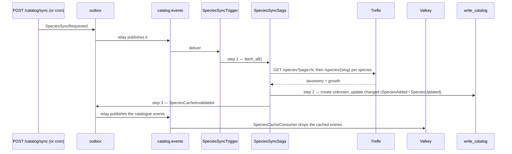

# Catalog: the Trefle ACL and the species cache

> **Status:** Phase 9. The upstream is `TrefleClient` behind
> `plantkeeper.infrastructure.external.trefle`; the synchronisation is still
> `SpeciesSyncSaga`, now fed by that client; the read path is `ValkeySpeciesCache`
> behind `GetSpeciesQuery`; and `SpeciesCacheConsumer` drops the keys an update
> made stale. The manual trigger is `POST /api/v1/catalog/sync`, the automatic one
> is `SpeciesSyncScheduler` — both publish the same `SpeciesSyncRequested`.

## The flow



## What Trefle actually returns

The contract in `external/trefle/models.py` mirrors the live API, which has two
properties the design has to live with:

- **List endpoints are light.** A page of `/species` carries taxonomy only
  (`id`, `slug`, `scientific_name`, `common_name`, `family`, `genus`, …) — no
  `growth`, so no light or soil indicator. Those exist only on
  `/species/{slug}`, one record per request.
- **Pages are fixed at 20 items**, and requests deeper than page 2,500 are
  rejected.

So one synchronisation of 30 species is two list requests plus 30 detail
requests — 32 requests, inside the free tier's 60/minute. `TREFLE_SPECIES_LIMIT`
caps how many records a run takes; the default is 30.

## The mapping (anti-corruption layer)

Trefle's vocabulary stops in `external/trefle/mapping.py`. Two of its fields are
Ellenberg ecological-indicator classes — where a species is *found*, not what it
tolerates — and the mapping turns them into domain values through fixed,
documented bands:

| `growth.light` (Ellenberg L, 1–9) | `LightRequirement` |
|-----------------------------------|--------------------|
| 1–3 | `LOW` |
| 4–6 | `MEDIUM` |
| 7–9 | `HIGH` |
| `null` | `MEDIUM` |

| `growth.soil_humidity` (Ellenberg F, 1–12) | `WateringInterval` |
|--------------------------------------------|--------------------|
| 1–2 | 3 days |
| 3–4 | 5 days |
| 5–6 | 7 days |
| 7–8 | 10 days |
| 9–10 | 14 days |
| 11–12 | 21 days |
| `null` | 7 days |

Note the ranges: soil humidity runs to **12**, not 9 (Ellenberg extended that
scale to cover the aquatic domain), and salinity starts at 0 — which is why the
mapping clamps rather than trusting the feed. A record is skipped (with a
warning) only when it has no scientific name; a missing common name falls back to
the scientific one, because the domain requires both to be non-blank.

### The identifier is a hash of the slug

Trefle has integer ids and slugs; the domain has `SpeciesId` (a UUID). The join
between the two is:

```
SpeciesId = uuid5(TREFLE_SPECIES_NAMESPACE, slug)
```

`TREFLE_SPECIES_NAMESPACE` is one fixed literal. **It must never change**: it is
what makes tomorrow's synchronisation recognise today's rows as the same species
instead of creating duplicates.

## Limiting, retrying, breaking

`TrefleClient` composes three guards, in this order:

1. **Rate limit** — `aiolimiter.AsyncLimiter(TREFLE_REQUESTS_PER_MINUTE, 60)`
   wraps every request, default 55 (one below the free tier).
2. **Retry** — `tenacity` retries a transient failure (`httpx.TransportError`,
   HTTP 429 or 5xx) up to `TREFLE_MAX_ATTEMPTS` times with exponential backoff.
   A 4xx other than 429 is a decision by the server and is not retried.
3. **Circuit breaker** — `AsyncCircuitBreaker` counts *logical* calls, so the
   retries above it do not inflate the count. After
   `TREFLE_BREAKER_FAILURE_THRESHOLD` consecutive failures it opens for
   `TREFLE_BREAKER_RESET_SECONDS`; while open, calls are refused without touching
   the network, and one trial is allowed when the timeout elapses. A success
   closes it and clears the count.

The breaker is project-owned (`infrastructure/external/circuit_breaker.py`) and
reads the `Clock` port: its reset timeout is exercised by advancing a clock in a
test, not by sleeping, and there is no library timer to monkeypatch.

Failures are translated into the client's own vocabulary: `TrefleAuthError`
(401/403), `TrefleRecordMissingError` (404/422), `TrefleUnavailableError`
(transport, 429 and 5xx after retries), and `CircuitOpenError` from the breaker.

### Never half a snapshot

`fetch_all` either returns a whole fetch or raises. A species whose *detail*
record is 404/422 or does not parse is skipped with a warning — one bad record
must not fail a nightly sync — but an availability failure aborts the fetch.
Diffing against a half-fetched catalogue would silently drop species, which is
worse than doing nothing.

### The fallback is the last snapshot

`TrefleSpeciesSource` remembers every successful fetch in Valkey
(`species:upstream:snapshot`, TTL `SPECIES_SNAPSHOT_TTL_SECONDS`). When Trefle is
unavailable or its breaker is open, it applies that snapshot instead: the
synchronisation runs against a slightly stale catalogue rather than failing. With
no snapshot cached it returns an empty list and the run finds no changes. An
auth failure is **not** papered over — a bad token is an operator's problem, and
stale data would hide it.

## The species cache

The cache is read-through and keyed `species:<uuid>`, holding the query layer's
own `SpeciesView` as JSON with a `SPECIES_CACHE_TTL_SECONDS` (24 h) expiry:

- `GetSpeciesQueryHandler` reads through it: hit ⇒ answer; miss ⇒ repository,
  then `set`.
- It is invalidated by `SpeciesCacheConsumer`, an ordinary worker consumer on
  `catalog.events` with its own group (`<prefix>-species-cache`) and its own
  ledger. It drops the key on `SpeciesUpdated` **and** on
  `SpeciesCacheInvalidated`.

Invalidation is deliberately event-driven rather than a call inside the saga:
the synchronisation's step 3 appends `SpeciesCacheInvalidated` to the outbox
(`OutboxSpeciesCache`), and the `DEL` happens once the event has travelled. That
keeps every Valkey call out of a database transaction and keeps Phase 4's step
sequence — and its compensation test — intact.

Two consequences, both accepted:

- An entry can be served between a commit and the consumer's `DEL`. The TTL
  bounds that window; a catalogue is not a ledger.
- A cache failure never becomes a request failure: `get` degrades to a miss,
  `set`/`invalidate` log and move on. A cache is an optimisation.

## `SpeciesAdded`

Phase 9 adds one domain event, the catalogue's 26th: `Species.add(...)` records
`SpeciesAdded` for an entry the synchronisation creates, mirroring `Plant.add`.
`SpeciesProjection` consumes it with the same upsert as `SpeciesUpdated`, so a
new species appears in `read_analytics.species` and in the admin. `Species.create`
still records nothing — reconstruction and tests use it.

## What a rollback can and cannot undo

`ApplySpeciesUpdatesStep.compensate` deletes every species the run created and
restores every before-image it changed (through `Species.update`, so the restore
is itself a `SpeciesUpdated` consumers see). The already-staged `SpeciesAdded`
cannot be unpublished — the same caveat ADR 0005 records for `PlantOnboarded` —
so after a compensated run the read side may keep a row for a species whose
write-side row is gone, until the read model is rebuilt from the topic. What the
write side does guarantee is that the local catalogue is back to its before-image.

## Configuration

| Variable | Default | Meaning |
|----------|---------|---------|
| `TREFLE_TOKEN` | *(empty)* | access token; empty makes every sync a no-op |
| `TREFLE_BASE_URL` | `https://trefle.io/api/v1` | where the API lives |
| `TREFLE_REQUESTS_PER_MINUTE` | `55` | client-side ceiling |
| `TREFLE_REQUEST_TIMEOUT_SECONDS` | `10` | one request's budget |
| `TREFLE_SPECIES_LIMIT` | `30` | species fetched per synchronisation |
| `TREFLE_MAX_ATTEMPTS` | `3` | retries per logical request |
| `TREFLE_BREAKER_FAILURE_THRESHOLD` | `5` | failures that open the breaker |
| `TREFLE_BREAKER_RESET_SECONDS` | `60` | how long it stays open |
| `SPECIES_CACHE_TTL_SECONDS` | `86400` | cached species lifetime |
| `SPECIES_SNAPSHOT_TTL_SECONDS` | `86400` | snapshot fallback lifetime |

Without a token the worker binds `UnconfiguredSpeciesSource`: `POST
/api/v1/catalog/sync` still answers `202`, and the saga completes with zero
changes.

## Known limits

- **Onboarding does not call Trefle.** `SpeciesCatalog` stays local: a plant whose
  species the catalogue has never seen gets no care schedule, exactly as in
  Phase 4. The scheduled synchronisation is what fills the catalogue, so
  onboarding never waits on an external HTTP call.
- **Upstream removal is not handled.** Trefle has no "species gone" signal, so a
  species that disappears upstream is left in the local catalogue forever.
- **The mapping is a heuristic.** The Ellenberg classes describe wild habitats,
  not greenhouse care; the bands are the starting point a domain expert would
  tune, and they are deliberately in one function.
- **A compensated creation can leave a read-model row** (see above).
