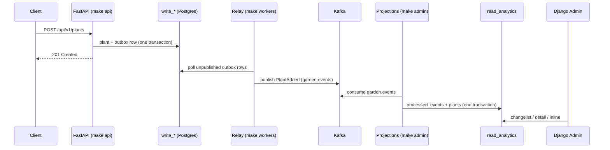

# CQRS: the write side and the read side

> **Status:** Phase 3 — the read path works end to end. `POST /api/v1/plants`
> becomes a row in `read_analytics.plants` and appears in Django Admin. The
> decisions behind this document are in
> [ADR 0004](adr/0004-read-side-projections.md).

PlantKeeper runs two persistence dialects that never mix. Commands go through
`python-cqrs` into the **write** schemas, managed by SQLAlchemy and Alembic.
Events go through Kafka into the **read** schema, managed by the Django ORM and
Django migrations. Nothing on the read side reads a `write_*` table, and nothing
on the write side reads `read_analytics`.

## The two sides

| | Write side | Read side |
|---|---|---|
| Process | `make api`, `make workers` | `make admin` |
| Schemas | `write_identity`, `write_catalog`, `write_garden`, `write_care`, `write_journal`, `write_telemetry`, `write_notifications`, `write_shared` | `read_analytics` |
| ORM | SQLAlchemy 2.0 async | Django ORM |
| Migrations | Alembic (`make migrate`) | Django (`manage.py migrate`) |
| Module | `packages/domain`, `packages/application`, `packages/infrastructure`, `apps/api`, `apps/workers` | `apps/admin` |
| Answers | "did the command succeed?" | "what does the system look like?" |

The read side is not a copy of the write schema. It is shaped by the questions
the admin asks: `plants` carries a denormalised `species_name` and the next
watering moment so the plant list renders in one query, and `notifications` keeps
each notification's small body in one `jsonb` column.

## The flow



## Projections

One consumer group per projection, one subscriber per topic. A topic carries
every event of its bounded context, so a projection dispatches on the
`event_name` header and ignores what is not its own.

| Projection | Consumer group | Topic | Events | Writes |
|---|---|---|---|---|
| `GardenProjection` | `<prefix>-garden` | `garden.events` | `PlantAdded`, `PlantMoved`, `PlantRemoved`, `PlantOnboarded` | `plants` — household, species id, name, location, `added_at`, `removed`, `onboarded_at` |
| `CareProjection` | `<prefix>-care` | `care.events` | `CareScheduleCreated`, `WateringCompleted`, `WateringRescheduled`, `CareSkipped`, `CareMissed` | `care_schedules` (all columns) and `plants.next_watering_at` |
| `SpeciesProjection` | `<prefix>-catalog` | `catalog.events` | `SpeciesUpdated` | `species` (all columns) and `plants.species_name` |
| `NotificationProjection` | `<prefix>-notifications` | `notifications.events` | `NotificationCreated`, `NotificationRead` | `notifications` |
| `JournalProjection` | `<prefix>-journal` | `journal.events` | `JournalEntryAdded` | `journal_entries`, and the placeholder `plants` row its foreign key needs |

`<prefix>` is `READ_SIDE_CONSUMER_GROUP_PREFIX` (`plantkeeper-read` by default).
Consumer groups are visible in Redpanda Console at <http://localhost:8080>.

**One writer per column.** A `plants` row is assembled from three topics consumed
independently, so every projection writes only its own columns and
`update_or_create` leaves the rest alone. The garden-owned columns are nullable
because a care or journal event can legitimately be projected before the
`PlantAdded` that names the plant; the row is briefly partial and the admin shows
`—`.

## Idempotency

Delivery is at-least-once ([ADR 0003](adr/0003-write-side-outbox.md)), so every
projection claims its event first:

```python
with transaction.atomic():
    _, created = ProcessedEvent.objects.get_or_create(
        consumer_group=consumer_group, event_id=event.event_id
    )
    if not created:
        return False  # already projected by this group
    handler(self, event)  # the projection's own writes
    return True
```

The claim and the writes share one transaction, which is what makes the retry
path correct: a failure rolls back both, so a redelivery starts from nothing
rather than from a row that says "done".

The ledger is browsable at `/admin/read_models/processedevent/`, filterable by
consumer group — which is the first place to look when a projection is behind.

## Read models

All in `read_analytics`, all owned by `apps/admin`'s migration
`read_models.0001_read_models`.

| Table | Model | Notes |
|---|---|---|
| `plants` | `PlantReadModel` | PK `plant_id`; index `(household_id, removed)` |
| `care_schedules` | `CareReadModel` | PK `plant_id`; index `next_watering_at` |
| `species` | `SpeciesReadModel` | PK `species_id` |
| `notifications` | `NotificationReadModel` | PK `notification_id`; index `(household_id, read_at)` |
| `journal_entries` | `JournalReadModel` | PK `entry_id`; FK → `plants` (cascade), index `(plant_id, occurred_at)` |
| `processed_events` | `ProcessedEvent` | unique `(consumer_group, event_id)` |

## Running it

```bash
make dev         # Kafka, Postgres, Valkey, Console
make migrate     # Alembic (write_*) then Django (read_analytics)
make api         # :8000 — commands
make workers     # the relay that publishes the outbox
make admin       # :8001 — projections + Django Admin
```

Then open <http://localhost:8001/admin/>. There is no login form: the process
selects one local superuser automatically
(see [ADR 0004](adr/0004-read-side-projections.md)). Set
`DJANGO_AUTO_LOGIN_USER=` in `.env` to remove that and fall back to Django's own
login, and create the user once with:

```bash
uv run python apps/admin/manage.py createsuperuser
```

The other port of the read side is `/healthz`, which answers without touching
Django or the database.

## Rebuilding a read model

Because every group starts at `earliest` and every projection is idempotent, a
read model can be thrown away and rebuilt from the topic:

```bash
# 1. stop `make admin`
docker exec plantkeeper-postgres psql -U plantkeeper -d plantkeeper \
  -c 'TRUNCATE read_analytics.plants CASCADE'
docker exec plantkeeper-kafka /opt/kafka/bin/kafka-consumer-groups.sh \
  --bootstrap-server localhost:9092 --delete --group plantkeeper-read-garden
# 2. start `make admin` again: the garden group replays garden.events from the start
```

Only the tables of the group whose offsets were reset need truncating, and the
ledger rows of that group go with them. Kafka's retention is the horizon: once a
topic has discarded an event, no replay can bring it back.

## What is not projected yet

The read side consumes five of the six context topics. What it deliberately leaves
alone is named in `tests/integration/test_projections.py` so that the gaps are
decisions rather than oversights:

- `WateringDue` — the schedule turns due; no read model shows that yet.
- `SpeciesSyncRequested`, `SpeciesCacheInvalidated` — a trigger and a cache
  concern, not read models.
- `TelemetryReceived`, `SoilMoistureLow`, `SoilMoistureHigh`, `TemperatureAnomaly`,
  `SensorOffline` — telemetry projections land in Phase 5.

Two read models are built and tested before their producers exist:
`journal_entries` (nothing publishes `JournalEntryAdded` before Phase 6) and
`species`/`plants.species_name` (nothing publishes `SpeciesUpdated` before the
Trefle synchronisation in Phase 9). Their projections are exercised directly in
`tests/integration/test_projections.py`.
