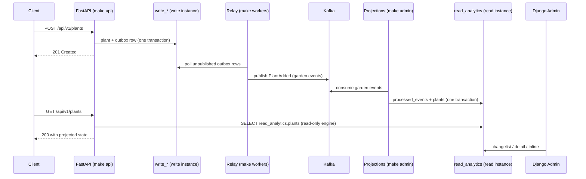

# CQRS: the write side and the read side

> **Status:** the split is complete. Commands go through the write side, and the
> client queries that ask what the system looks like — the plant list, what needs
> watering today, the catalogue list, the journal timeline — are answered from the
> read models on the read side's own database. The decisions behind the read models
> are in [ADR 0004](adr/0004-read-side-projections.md); the write side's consumers
> are in [`docs/sagas.md`](sagas.md) and
> [ADR 0005](adr/0005-orchestration-vs-choreography.md).

PlantKeeper runs two persistence dialects that never mix. Commands go through
`python-cqrs` into the **write** schemas, managed by SQLAlchemy and Alembic.
Events go through Kafka into the **read** schema, managed by the Django ORM and
Django migrations. Nothing on the read side reads a `write_*` table, and nothing
on the write side reads `read_analytics` or `read_telemetry`.

## The two sides

| | Write side | Read side |
|---|---|---|
| Process | `make api`, `make workers` | `make admin` |
| Database | the write instance (`POSTGRES_*`, port 5432) | the read instance (`READ_POSTGRES_*`, port 5433) |
| Schemas | `write_identity`, `write_catalog`, `write_garden`, `write_care`, `write_journal`, `write_telemetry`, `write_notifications`, `write_shared` | `read_analytics` (domain read models), `read_telemetry` (telemetry rollups) |
| ORM | SQLAlchemy 2.0 async | Django ORM (writes) and read-only SQLAlchemy (queries) |
| Migrations | Alembic (`make migrate`) | Django (`manage.py migrate`) |
| Module | `packages/domain`, `packages/application`, `packages/infrastructure`, `apps/api`, `apps/workers` | `apps/admin`, plus the API's read-only query engine |
| Answers | "did the command succeed?" | "what does the system look like?" |

Two Postgres instances, not two schemas of one: a projection rebuild and the admin's
queries stop competing with the write path, and a truncate-and-replay of a read model
cannot reach a write table. The split is configuration — both URLs are settings, both
default to the same credentials and only the port differs — so pointing
`READ_POSTGRES_*` back at the write instance collapses it again. The commands, the
verification and that rollback are in
[`docs/runbooks/local-topology.md`](runbooks/local-topology.md).

The read side is not a copy of the write schema. It is shaped by the questions
the admin asks: `plants` carries a denormalised `species_name` and the next
watering moment so the plant list renders in one query, and `notifications` keeps
each notification's small body in one `jsonb` column. Telemetry keeps a schema of
its own (`read_telemetry`) because its rollups are the platform's highest-volume read
model and are rebuilt on a schedule of their own — see
[`docs/telemetry.md`](telemetry.md).

## The flow


```mermaid
sequenceDiagram
    participant C as Client
    participant API as FastAPI (make api)
    participant DB as write_* (write instance)
    participant W as Relay (make workers)
    participant K as Kafka
    participant A as Projections (make admin)
    participant R as read_analytics (read instance)
    participant Adm as Django Admin

    C->>API: POST /api/v1/plants
    API->>DB: plant + outbox row (one transaction)
    API-->>C: 201 Created
    W->>DB: poll unpublished outbox rows
    W->>K: publish PlantAdded (garden.events)
    A->>K: consume garden.events
    A->>R: processed_events + plants (one transaction)
    C->>API: GET /api/v1/plants
    API->>R: SELECT read_analytics.plants (read-only engine)
    API-->>C: 200 with projected state
    Adm->>R: changelist / detail / inline
```

## Which side answers which question

The split is by the kind of question, not by the endpoint's verb:

| Question | Answered from | Why |
|---|---|---|
| `GET /api/v1/plants` — the household's plants | read model | a list: what the system looks like |
| `GET /api/v1/care/today` — what is due today | read model | a report: what the system looks like |
| `GET /api/v1/catalog/species` — the catalogue | read model | a list |
| `GET /api/v1/journal/{plant_id}` — the timeline | read model | a browsable timeline |
| `POST /api/v1/plants` and every other command's answer | write store | the caller must see its own write |
| `GET /api/v1/plants/{plant_id}`, `GET /api/v1/households/{id}`, `GET /api/v1/catalog/species/{id}` | write store | a command's answer, or the read a command needs |
| `GET /api/v1/journal/{plant_id}/at` — the as-of-date replay | write store | a replay of the event store, which is the journal's source of truth |
| `GET /api/v1/notifications/stream`, `GET /api/v1/notifications/pending` and `POST …/ack` | write store | delivery: the stream, the request-and-wait form and the nudge channel must agree on the same rows |
| `GET /api/v1/sensors` | write store | the sensor registry is a write-side fact; the telemetry read side holds measurements, not the registry |

The read models are projections, and a projection is asynchronous. That leaves a
**staleness window**: a list served moments after a command changed the same rows
may not show the change yet, because the event is still travelling
`outbox → relay → Kafka → projection`. The window is bounded by the relay's poll
interval plus the projection's consumer lag — normally well under a second on a
local stack, and visible in Redpanda Console or at
`/admin/read_models/processedevent/` when it is not. A client tolerates it, the
command's own answer never lies (it comes from the write store), and a read model
that falls behind is caught up by replaying it (below).

## Projections

One consumer group per projection, one subscriber per topic. A topic carries
every event of its bounded context, so a projection dispatches on the
`event_name` header and ignores what is not its own.

| Projection | Consumer group | Topic | Events | Writes |
|---|---|---|---|---|
| `GardenProjection` | `<prefix>-garden` | `garden.events` | `PlantAdded`, `PlantMoved`, `PlantRemoved`, `PlantOnboarded` | `plants` — household, species id, name, location, `added_at`, `removed`, `onboarded_at` |
| `CareProjection` | `<prefix>-care` | `care.events` | `CareScheduleCreated`, `WateringCompleted`, `WateringRescheduled`, `CareSkipped`, `CareMissed` | `care_schedules` (all columns) and `plants.next_watering_at` |
| `SpeciesProjection` | `<prefix>-catalog` | `catalog.events` | `SpeciesAdded`, `SpeciesUpdated` | `species` (all columns) and `plants.species_name` |
| `NotificationProjection` | `<prefix>-notifications` | `notifications.events` | `NotificationCreated`, `NotificationRead` | `notifications` |
| `JournalProjection` | `<prefix>-journal` | `journal.events` | `JournalEntryAdded` | `journal_entries`, and the placeholder `plants` row its foreign key needs |
| `TelemetryRollupProjection` | `<prefix>-telemetry-rollup` | `telemetry.events` | `TelemetryReceived`, `SoilMoistureLow`, `SoilMoistureHigh`, `TemperatureAnomaly`, `SensorOffline` | `read_telemetry.telemetry_rollups` (one window per sensor per hour) and `read_telemetry.sensor_latest` (newest reading, newest alert, last silence) |

`<prefix>` is `READ_SIDE_CONSUMER_GROUP_PREFIX` (`plantkeeper-read` by default).
Consumer groups are visible in Redpanda Console at <http://localhost:8080>.

**One writer per column.** A `plants` row is assembled from three topics consumed
independently, so every projection writes only its own columns and
`update_or_create` leaves the rest alone. The garden-owned columns are nullable
because a care or journal event can legitimately be projected before the
`PlantAdded` that names the plant; the row is briefly partial and the admin shows
`—`.

## Idempotency

Delivery is at-least-once ([ADR 0003](adr/0003-write-side-outbox.md)), so every
projection claims its event first:

```python
with transaction.atomic():
    _, created = ProcessedEvent.objects.get_or_create(
        consumer_group=consumer_group, event_id=event.event_id
    )
    if not created:
        return False  # already projected by this group
    handler(self, event)  # the projection's own writes
    return True
```

The claim and the writes share one transaction, which is what makes the retry
path correct: a failure rolls back both, so a redelivery starts from nothing
rather than from a row that says "done".

What happens to a projection that keeps failing is the platform's consumer failure
policy rather than a read-side special case
([ADR 0011](adr/0011-consumer-failure-policy.md)): the delivery is retried
`CONSUMER_MAX_ATTEMPTS` times with backoff, then copied to `plantkeeper.dlq.v1` with
its consumer group, origin and cause, and claimed in this ledger with the copy — so
the partition moves on and an operator can put the delivery back once the cause is
fixed. The copy is published before the claim is recorded, because Django's
synchronous ORM cannot join an async publish in one transaction.

The ledger is browsable at `/admin/read_models/processedevent/`, filterable by
consumer group — which is the first place to look when a projection is behind.

## Read models

All in `read_analytics`, all owned by `apps/admin`'s migration
`read_models.0001_read_models`, all on the read instance.

| Table | Model | Notes |
|---|---|---|
| `plants` | `PlantReadModel` | PK `plant_id`; index `(household_id, removed)` |
| `care_schedules` | `CareReadModel` | PK `plant_id`; index `next_watering_at` |
| `species` | `SpeciesReadModel` | PK `species_id` |
| `notifications` | `NotificationReadModel` | PK `notification_id`; index `(household_id, read_at)` |
| `journal_entries` | `JournalReadModel` | PK `entry_id`; FK → `plants` (cascade), index `(plant_id, occurred_at)` |
| `processed_events` | `ProcessedEvent` | unique `(consumer_group, event_id)` |

Django writes them; the API reads four of them through the read-only SQLAlchemy
mappings in `plantkeeper.infrastructure.persistence.models.read_models`. Two ORMs
over one schema is the price of the split, so the mappings carry only the columns
the queries need, nothing ever writes through them, and their connections are
opened with `default_transaction_read_only=on`. `tests/integration/test_read_model_mapping.py`
fails when a mapped column and its Django field disagree, and a mapping that
names a column Django does not have fails there too.

## Running it

```bash
make dev         # Kafka, both Postgres instances, Valkey, Console
make migrate     # Alembic on the write instance, then Django on the read instance
make api         # :8000 — commands and the client queries
make workers     # the relay that publishes the outbox
make admin       # :8001 — projections + Django Admin
```

`make api` opens both databases: the write engine for every command, and a second,
read-only engine for the four list/report queries. A process that never serves one
never opens the read instance — the provider is lazy — and the read instance being
down degrades the queries without failing a command
([`docs/runbooks/local-topology.md`](runbooks/local-topology.md)).

Then open <http://localhost:8001/admin/>. There is no login form: the process
selects one local superuser automatically
(see [ADR 0004](adr/0004-read-side-projections.md)). Set
`DJANGO_AUTO_LOGIN_USER=` in `.env` to remove that and fall back to Django's own
login, and create the user once with:

```bash
uv run python apps/admin/manage.py createsuperuser
```

The other port of the read side is `/healthz`, which answers without touching
Django or the database.

## Rebuilding a read model

Because every group starts at `earliest` and every projection is idempotent, a
read model can be thrown away and rebuilt from the topic:

```bash
# 1. stop `make admin`
docker exec plantkeeper-postgres-read psql -U plantkeeper -d plantkeeper \
  -c 'TRUNCATE read_analytics.plants CASCADE'
docker exec plantkeeper-kafka /opt/kafka/bin/kafka-consumer-groups.sh \
  --bootstrap-server localhost:9092 --delete --group plantkeeper-read-garden
# 2. start `make admin` again: the garden group replays garden.events from the start
```

Only the tables of the group whose offsets were reset need truncating, and the
ledger rows of that group go with them. The truncate targets `plantkeeper-postgres-read`,
not `plantkeeper-postgres`: `read_analytics` lives on the read instance, and saying
so is the difference between a rebuild and an error. Kafka's retention is the
horizon: once a topic has discarded an event, no replay can bring it back.
`read_telemetry` is rebuilt the same way, with its own group and tables — see
[`docs/telemetry.md`](telemetry.md).

## What is deliberately not projected

The read side consumes every context topic. What it deliberately leaves
alone is named in `tests/integration/test_projections.py` so that the gaps are
decisions rather than oversights:

- `WateringDue` — the schedule turns due; no read model shows that yet.
- `SpeciesSyncRequested`, `SpeciesCacheInvalidated` — a trigger and a cache
  concern, not read models.
- the saga lifecycle events — the saga's execution row in `write_shared.saga_state`
  is the authoritative record, and they are its event stream.

`species`/`plants.species_name` used to be in that list: it was built in Phase 3
before it had a producer, and since Phase 9 the Trefle synchronisation publishes
`SpeciesAdded` and `SpeciesUpdated` for it. The catalogue's read path also goes
through the Valkey cache (`docs/catalog.md`); `SpeciesCacheInvalidated` stays
unprojected because it is the cache's signal, not a read model.

`journal_entries` used to be in that list: since Phase 6 the write side's
`JournalEntryConsumer` produces `JournalEntryAdded` from a completed watering, and the
journal itself is event-sourced (`docs/event-sourcing.md`) — the read model is the
admin's view of a stream the write side keeps as its source of truth.
