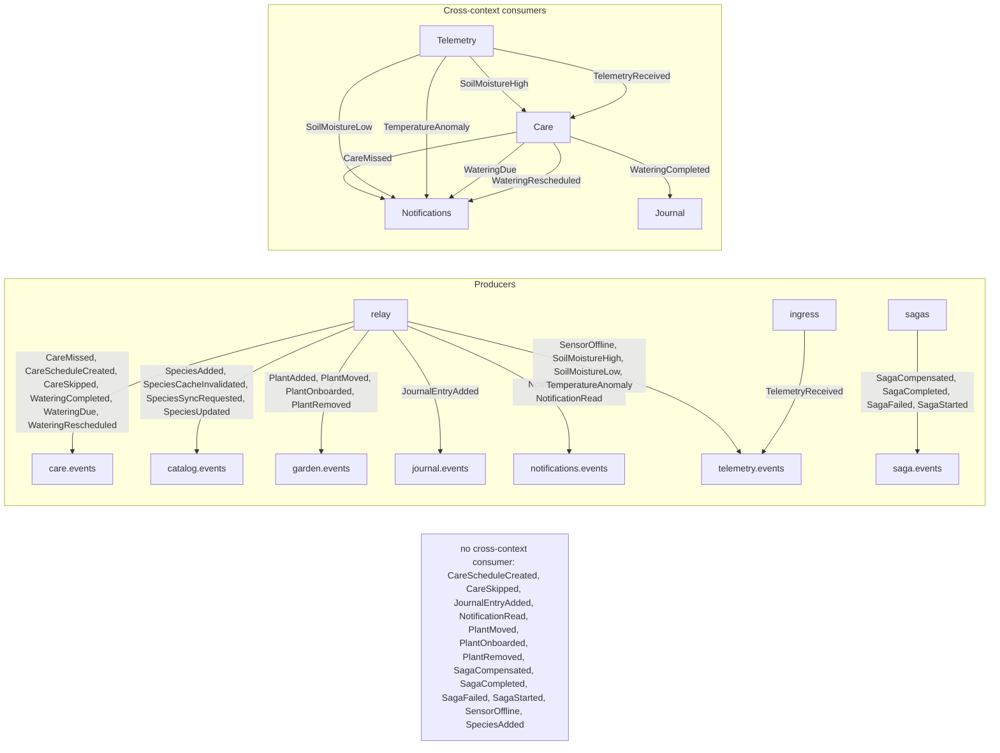

# Event flow — generated

> **Generated by `make diagrams` (`tools/contracts.py`) — do not edit by hand.**
> The producer edges come from `EVENT_TOPICS` and the component that publishes each
> event; the consumer edges come from the saga, projection and write-side consumer
> registries. A test fails if this file and the code disagree.
>
> A consumer edge is drawn only when it crosses a bounded context: an event's own
> context consuming it is the default, and drawing every one of those would turn
> the diagram into a restatement of `docs/events.md`.

