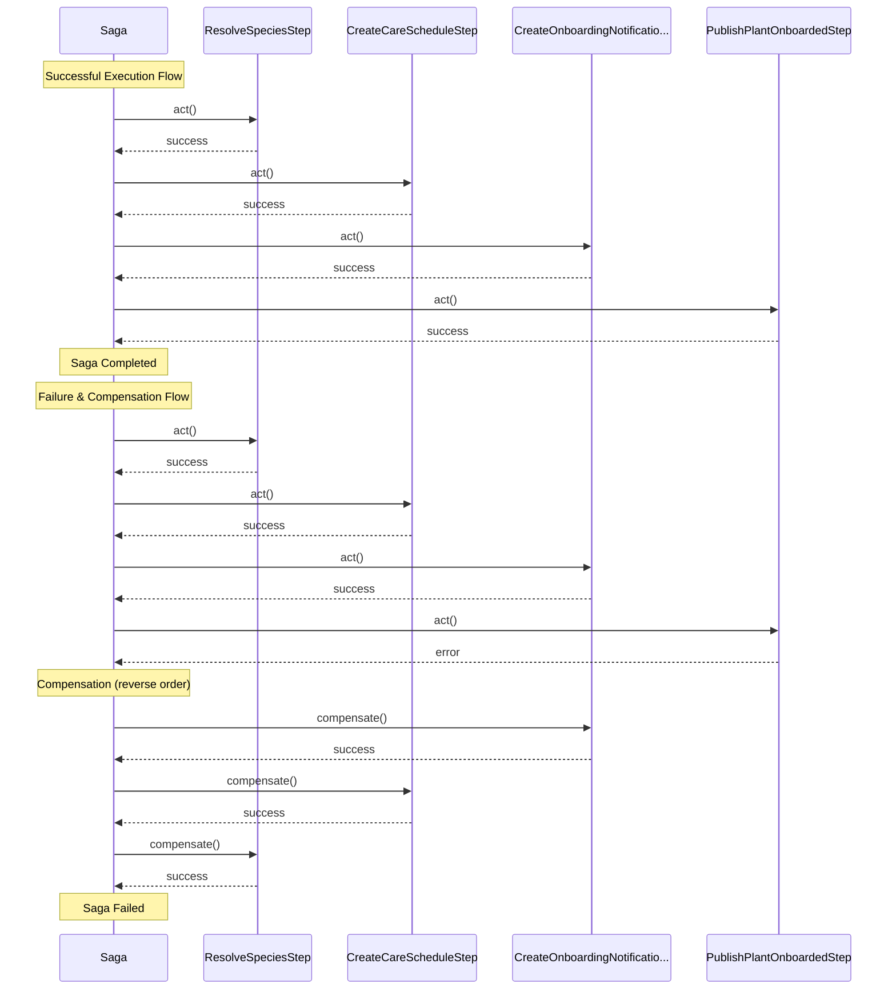
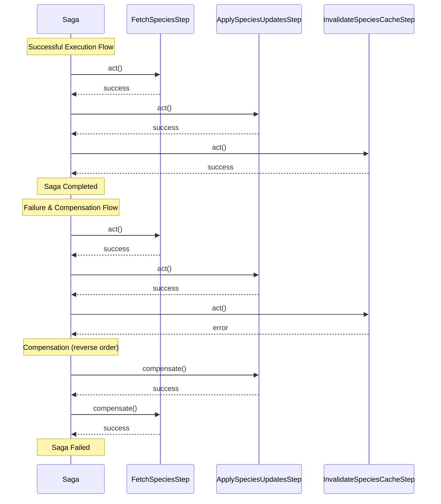

# Orchestration sagas — generated

> **Generated by `make diagrams` (`tools/contracts.py`) — do not edit by hand.**
> Rendered by `python-cqrs`' own `SagaMermaid` from each saga's real step list, so
> the participants below are the step classes in the code. A test fails if this
> file and the code disagree.

## `OnboardPlantSaga`

## `SpeciesSyncSaga`

