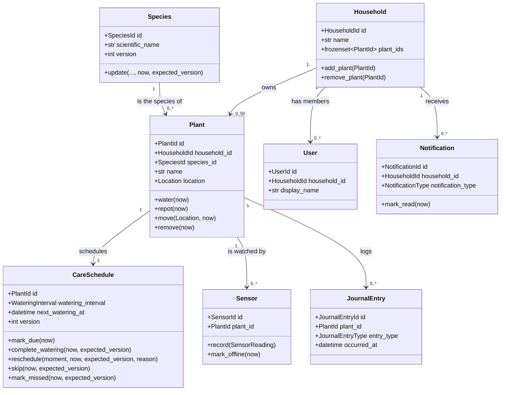

# Domain

> **Status:** Phase 1 complete — seven bounded contexts with aggregates, value
> objects, domain events and invariant tests live in `packages/domain`. The event
> catalogue is in [`docs/events.md`](events.md); the reasoning behind the context
> split is in [`docs/adr/0002-bounded-contexts.md`](adr/0002-bounded-contexts.md).

## Overview

The domain layer (`packages/domain`) is pure Python: it imports nothing from
infrastructure, web frameworks or ORMs, and it is the only layer allowed to define
business invariants. Pydantic is the sole dependency, used for value objects and
domain events. The import-linter contracts in the root `pyproject.toml` enforce both
the layer direction and the independence of the bounded contexts (`make lint`).

## Ubiquitous language

| Term | Meaning |
|------|---------|
| Household | The family unit that owns the plants; at most 50 plants |
| Plant | A physical plant in the household, bound to a species and a location |
| Species | A catalogue entry describing ideal care (synchronised from Trefle) |
| Care schedule | The next watering moment of one plant, versioned for optimistic locking |
| Sensor reading | One immutable measurement: moisture, temperature, light, timestamp |
| Journal entry | An immutable, append-only record of care performed on one plant |
| Notification | A message for the household, delivered by HTTP long polling |
| User | A household member; this project has no authentication |

## Bounded contexts and aggregates

| Context | Aggregates | Invariants | Storage (Phase 2+) |
|---------|-----------|------------|--------------------|
| Garden | `Plant`, `Household` | Name is not blank; no two waterings within an hour; no repotting more often than every 182 days; at most 50 plants per household | `write_garden` |
| Care | `CareSchedule` | Interval > 0; next watering ≥ now; `version` increments on every change | `write_care` |
| Catalog | `Species` | Scientific and common names are not blank; `version` increments on every change | `write_catalog` + Valkey |
| Journal | `JournalEntry`, `JournalStream` | Append-only and immutable; one stream per plant; no duplicate entry | `write_journal` |
| Telemetry | `Sensor` | A reading must come from its own sensor; a sensor belongs to exactly one plant; offline only after 10 silent minutes | `write_telemetry` |
| Notifications | `Notification` | Acknowledged at most once; `read_at` is set by an explicit ack | `write_notifications` |
| Identity | `User` | Display name is not blank; a user belongs to exactly one household | `write_identity` |
| Analytics | *(none — read side)* | Projections are built from Kafka events | `read_analytics` |

Analytics has no domain aggregates: it is the read-model context described in
[`docs/architecture.md`](architecture.md) and is built from events in Phase 3.

## Value objects

| Value object | Rule |
|--------------|------|
| `HouseholdId`, `PlantId`, `SensorId`, `SpeciesId`, `JournalEntryId`, `NotificationId`, `UserId` | Typed UUIDv7 wrappers; identifiers of different types are never equal |
| `Location` | Non-blank string, 1–100 characters after trimming |
| `Moisture` | Float 0–100 |
| `Temperature` | Float −50..+60 °C |
| `LightLevel` | Float ≥ 0 lux |
| `CareInterval` (`WateringInterval`, `FertilizingInterval`, `RepottingInterval`) | `timedelta` strictly greater than zero |
| `CareRule` | One watering, one fertilising and one repotting interval |
| `SensorReading` | `SensorId` + timezone-aware `recorded_at` + moisture, temperature, light |

All value objects are frozen Pydantic models with `extra="forbid"`: they are
immutable, validate their own boundary on construction, and reject unknown fields.
`CareSchedule` is identified by its `PlantId` — a plant has exactly one schedule —
and `JournalStream` is keyed by the same identifier.

## Domain events

Garden: `PlantAdded`, `PlantRemoved`, `PlantMoved`, `PlantOnboarded`.
Care: `CareScheduleCreated`, `WateringDue`, `WateringCompleted`, `WateringRescheduled`,
`CareMissed`, `CareSkipped`.
Catalog: `SpeciesSyncRequested`, `SpeciesUpdated`, `SpeciesCacheInvalidated`.
Journal: `JournalEntryAdded`.
Telemetry: `TelemetryReceived`, `SoilMoistureLow`, `SoilMoistureHigh`,
`TemperatureAnomaly`, `SensorOffline`.
Notifications: `NotificationCreated`, `NotificationRead`.
Saga / system: `SagaStarted`, `SagaCompleted`, `SagaFailed`, `SagaCompensated`.

The payload catalogue — producer, payload fields and consumers — is in
[`docs/events.md`](events.md). The saga events report the progress of the process
managers described in [`docs/sagas.md`](sagas.md); they are catalogued here because
every message on Kafka is a `DomainEvent`, not because they are aggregate facts.

## Aggregate map

## Invariants and thresholds

| Invariant | Constant | Where |
|-----------|----------|-------|
| Watering twice within an hour is refused | `MIN_WATERING_INTERVAL = 1 hour` | `garden/plant.py` |
| Repotting within roughly six months is refused | `MIN_REPOTTING_INTERVAL = 182 days` | `garden/plant.py` |
| A household owns at most 50 plants | `MAX_PLANTS = 50` | `garden/household.py` |
| Moisture below 30 % is low, above 80 % is overwatering | `MOISTURE_LOW_THRESHOLD`, `MOISTURE_HIGH_THRESHOLD` | `telemetry/sensor.py` |
| Temperature outside 10–35 °C is an anomaly | `TEMPERATURE_LOW_THRESHOLD`, `TEMPERATURE_HIGH_THRESHOLD` | `telemetry/sensor.py` |
| A silent sensor is offline after 10 minutes | `OFFLINE_AFTER = 10 minutes` | `telemetry/sensor.py` |
| Next watering is never scheduled in the past | — | `care/schedule.py` |
| Optimistic locking on every schedule/species change | — | `care/schedule.py`, `catalog/species.py` |

Boundary values are inclusive: moisture exactly 30 or 80, temperature exactly 10 or
35, a watering exactly one hour after the previous one, and a repot exactly 182 days
after the previous one are all allowed (or, for thresholds, not alerts).

## Testing

`make test-domain` runs `tests/unit/domain/` with a 90 % coverage floor; the domain
layer currently sits at 100 % statement and branch coverage. Each invariant above has
a boundary test, and `tests/unit/domain/test_events_catalogue.py` keeps the code and
the event catalogue in [`docs/events.md`](events.md) from drifting apart.

## References

- [`docs/events.md`](events.md) — domain event catalogue
- [`docs/architecture.md`](architecture.md) — contexts, layers, data flow
- [`docs/adr/0002-bounded-contexts.md`](adr/0002-bounded-contexts.md) — why these eight contexts
- [`ROADMAP.md`](../ROADMAP.md) — phases and their Definition of Done
