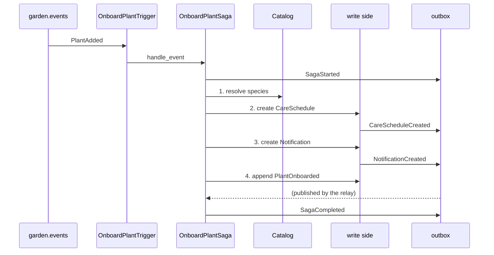
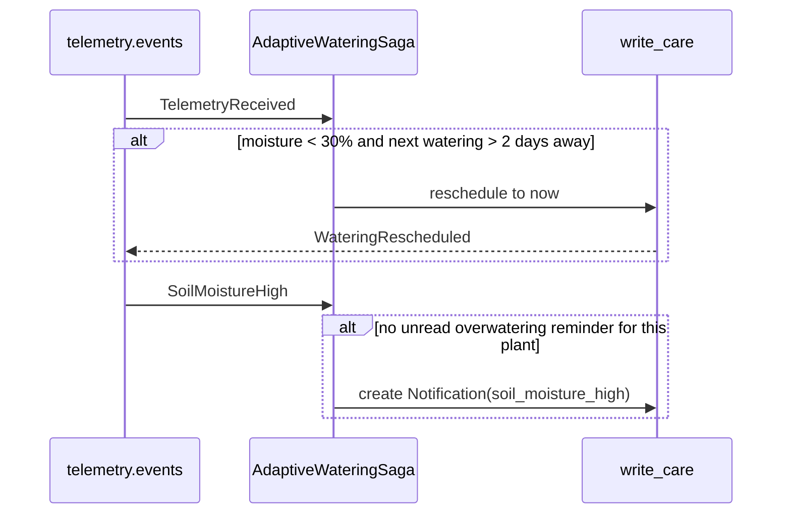
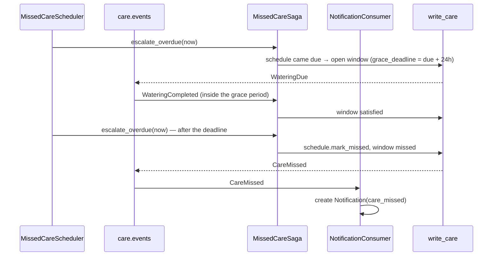
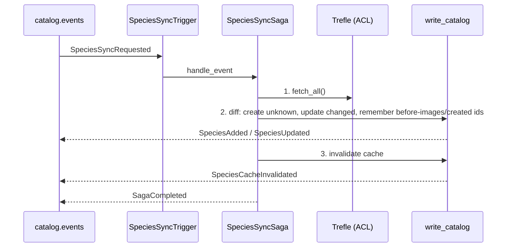

# Sagas

> **Status:** the four process managers run in `apps/workers` (`make workers`),
> alongside the outbox relay. The architectural decision behind their two shapes is
> [ADR 0005](adr/0005-orchestration-vs-choreography.md); their real step sequences are
> generated into [`docs/diagrams/sagas.md`](diagrams/sagas.md) by `make diagrams`.

A *saga* here is a long-running reaction to domain events: it spans several
transactions, several aggregates, and sometimes a wall-clock delay. This document
describes the four the project ships, how they are wired, and how to run, observe
and recover them.

## Two shapes

| Shape | The saga owns | Where it lives | Sagas |
|-------|---------------|----------------|-------|
| **Orchestration** | An ordered list of steps and their compensations | `Saga` + `SagaStepHandler` subclasses, executed by the cqrs engine | `OnboardPlantSaga`, `SpeciesSyncSaga` |
| **Choreography** | Nothing but its reaction | A `Consumer` subclass, one handler chain per topic | `AdaptiveWateringSaga`, `MissedCareSaga` |

An orchestration saga keeps its progress in `write_shared.saga_state` and its step
history in `write_shared.saga_log`. A choreography saga keeps only the state its
reaction genuinely needs — for the missed-care grace period, that is a row in
`write_care.missed_care_windows`.

## Wiring

```
POST /api/v1/plants ──► outbox ──► relay ──► garden.events ──► OnboardPlantTrigger
                                                                     │
                                                          OnboardPlantSaga (4 steps)
                                                                     │
                                        write_care + write_notifications + outbox
```

Every consumer subscribes with a group of its own
(`<WORKER_CONSUMER_GROUP_PREFIX>-onboard-plant`, `…-adaptive-watering`,
`…-missed-care`, `…-species-sync`) and `auto_offset_reset="earliest"`. Before it
does any work it claims `(consumer_group, event_id)` in
`write_shared.processed_events`; the claim commits with the work, so a redelivery
is a no-op and a failure releases the claim for the retry.

**A saga writes the way the API does, not through the API.** Its steps are plain
application-layer handlers, so a step that changes the domain goes through the same
`UnitOfWork` as an HTTP command — repositories over the request's session, one commit —
and the events it produces land in the outbox of that commit, which the relay then
publishes. There is no command port and no round trip through `make api`: the
orchestration sagas run inside the `make workers` process and share the application
layer with the API, which is the design [ADR 0005](adr/0005-orchestration-vs-choreography.md)
chose. What a saga *does* own separately is its own progress: `SagaStarted`,
`SagaCompleted`, `SagaFailed` and `SagaCompensated` go to the outbox like any other
event, while the engine's execution row and step log are committed by the saga storage
in a session of its own, outside the unit of work — the crash window is listed under
*Known limitations* below.

No consumer writes another context's tables — every mutation goes through the shared
`UnitOfWork`, so a saga's writes stay in the contexts it owns (`write_care`,
`write_notifications`, `write_catalog`). Reading across a boundary is the one place the
shared session is used directly: the notification and journal consumers resolve a
`plant_id` from the Garden tables, and the onboarding saga reads the catalogue through
its `SpeciesCatalog` port, which is a local read of `write_catalog` rather than a call
into another context. Everything else travels as an event; `docs/architecture.md` treats
that catalogue lookup as the project's one documented exception.

## OnboardPlantSaga — orchestration

Trigger: `PlantAdded`. Deterministic id: `uuid5("OnboardPlantSaga:<plant_id>")`.



| Step | Writes | Compensation |
|------|--------|--------------|
| 1. `ResolveSpeciesStep` | nothing | nothing |
| 2. `CreateCareScheduleStep` | `write_care.care_schedules` | delete the schedule |
| 3. `CreateOnboardingNotificationStep` | `write_notifications.notifications` | delete the notification |
| 4. `PublishPlantOnboardedStep` | outbox | none — a published event cannot be unpublished |

Each step commits its own transaction, so a failure in step 3 rolls back the
schedule from step 2 in a fresh transaction, and the saga ends `failed` with
`SagaFailed` + `SagaCompensated` on `saga.events`.

## AdaptiveWateringSaga — choreography

Trigger: `TelemetryReceived`, `SoilMoistureHigh` (topic `telemetry.events`).



`WATERING_HORIZON` (2 days) and `MOISTURE_LOW_THRESHOLD` come from one place each:
the horizon is the saga's own constant, the threshold is
`plantkeeper.domain.telemetry.sensor`'s, so telemetry and its consumer cannot
disagree about what "dry" means. Pulling the schedule to *now* is what stops a
10-second telemetry stream from becoming an event storm: the condition no longer
holds on the next reading. The overwatering reminder is deduplicated against the
household's **unread** notifications, so a sensor that reports 95% all afternoon
produces one message.

## MissedCareSaga — choreography with a timer

Trigger: `WateringDue`, `WateringCompleted` (topic `care.events`), plus
`MissedCareScheduler` in the worker.



| Event | State change |
|-------|--------------|
| `WateringDue` | upsert `MissedCareWindow(pending, grace_deadline = due_at + 24h)` |
| `WateringCompleted` | `pending → satisfied`, if the watering was inside the grace period |
| scheduler tick | open windows for newly due schedules; for expired pending windows: `mark_missed` (shifts the schedule), `pending → missed` |

The `care_missed` reminder is `NotificationConsumer`'s ([`docs/notifications.md`](notifications.md)),
not this saga's: the saga owns the schedule and the window, and the Notifications
context owns what the household sees. It reacts to the `CareMissed` recorded on the
tick.

The anti-join in `list_due_without_pending_window` is what makes the tick
idempotent: once a window is open, the schedule stops being "newly due", so a tick
every minute records one `WateringDue`, not one per minute. A watering that
arrives *after* the deadline does not erase the miss.

## SpeciesSyncSaga — orchestration

Trigger: `SpeciesSyncRequested` (topic `catalog.events`), published by both the
manual `POST /api/v1/catalog/sync` and the daily `SpeciesSyncScheduler`.
Deterministic id: `uuid5("SpeciesSyncSaga:<trigger event_id>")` — one saga per
request.



| Step | Writes | Compensation |
|------|--------|--------------|
| 1. `FetchSpeciesStep` | nothing | nothing |
| 2. `ApplySpeciesUpdatesStep` | `write_catalog.species` | delete every created id, restore every before-image |
| 3. `InvalidateSpeciesCacheStep` | outbox (`SpeciesCacheInvalidated`) | nothing local to undo |

Step 3 exists so that step 2 can *fail after committing* — which is exactly the
case compensation is for. The restore goes through `Species.update`, so it records
a `SpeciesUpdated` of its own: a rollback is a catalogue change its consumers must
see, not a silent rewrite. An upstream species the local catalogue does not know
is created with `Species.add`, which records `SpeciesAdded`; the compensation
deletes it again. Species that vanished upstream are left alone — Trefle has no
"species gone" signal. See [`docs/catalog.md`](catalog.md) for the Trefle
contract, the mapping and the cache.

## Idempotency, recovery and observability

- **Idempotency.** Redelivery is stopped by the `processed_events` claim; a
  replay from a fresh consumer group is stopped by the saga's deterministic id and
  the engine's *already completed* check. Both are exercised by tests.
- **Recovery.** `SagaRecoveryJob` polls `saga_state` for `running`/`compensating`
  rows that have not been touched for `SAGA_RECOVERY_STALE_AFTER_SECONDS`, and
  hands them to `cqrs.saga.recovery.recover_saga`, which skips the steps already in
  `saga_log` and finishes an interrupted compensation. A saga that fails recovery
  `SAGA_RECOVERY_MAX_ATTEMPTS` times is left alone for an operator.
- **Lifecycle events.** `SagaStarted`, `SagaCompleted`, `SagaFailed`,
  `SagaCompensated` travel on `saga.events`, keyed by `saga_id`, so one saga's
  four messages stay in one partition and in order.
- **Inspecting a saga**

  ```sql
  SELECT id, name, status, version, recovery_attempts, created_at, updated_at
    FROM write_shared.saga_state ORDER BY updated_at DESC;

  SELECT step_name, action, status, details, created_at
    FROM write_shared.saga_log WHERE saga_id = $1 ORDER BY created_at, id;

  SELECT consumer_group, event_id, processed_at
    FROM write_shared.processed_events
   WHERE consumer_group = 'plantkeeper-worker-onboard-plant'
   ORDER BY processed_at DESC LIMIT 20;
  ```

## Running it

`make workers` runs the whole write-side back end in one process: the outbox relay, the
eight write-side consumer groups (the two orchestration triggers and the six
choreography consumers), the telemetry ingress on `telemetry.raw`, and the four timers —
the missed-care tick, the daily catalogue trigger, the saga recovery job and the
readings table's partition window. Relevant settings (see `.env.example`):

| Setting | Default | Meaning |
|---------|---------|---------|
| `WORKER_CONSUMER_GROUP_PREFIX` | `plantkeeper-worker` | group prefix for every saga consumer |
| `MISSED_CARE_CHECK_INTERVAL_SECONDS` | `60` | how often the grace-period tick runs |
| `SPECIES_SYNC_INTERVAL_SECONDS` | `86400` | how often the daily sync is requested |
| `SAGA_RECOVERY_INTERVAL_SECONDS` | `30` | how often crashed sagas are looked for |
| `SAGA_RECOVERY_MAX_ATTEMPTS` | `5` | failed recoveries before a saga is left alone |
| `SAGA_RECOVERY_STALE_AFTER_SECONDS` | `60` | age before a running saga is considered crashed |

## Known limitations

- Compensating a step that published an event cannot recall the message. The
  onboarding sequence publishes last for that reason; a compensated onboarding can
  leave a stale read-side care row until the read model is rebuilt
  (`docs/cqrs.md`).
- A crash between a step's commit and the saga-state checkpoint is resolved by
  recovery re-running from `saga_log`; the log entry is written before the next
  step starts, and steps are written to be idempotent.
- `SpeciesSyncSaga` never deletes a local species: Trefle has no "species gone"
  signal, so local entries outlive an upstream removal (`docs/catalog.md`).
- The compensation of a catalogue creation deletes the write-side row, but the
  `SpeciesAdded` it published cannot be recalled — the same case as
  `PlantOnboarded` above.
- `SagaStateRepository` has no production caller: recovery goes through the
  library's `ISagaStorage.get_sagas_for_recovery`, which answers ids only. The
  repository is a reading facade over the same table and is covered by an
  integration test.
