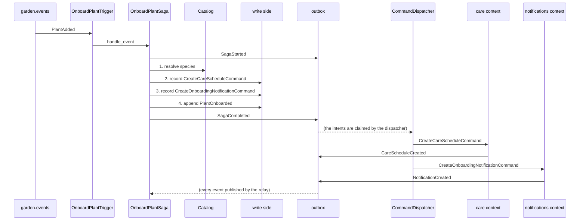
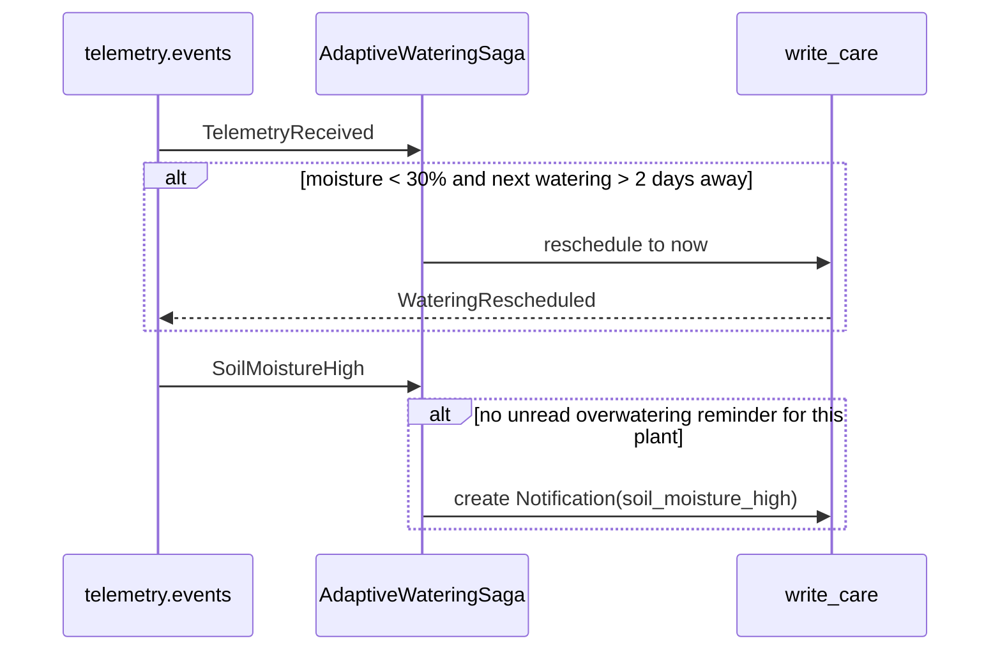
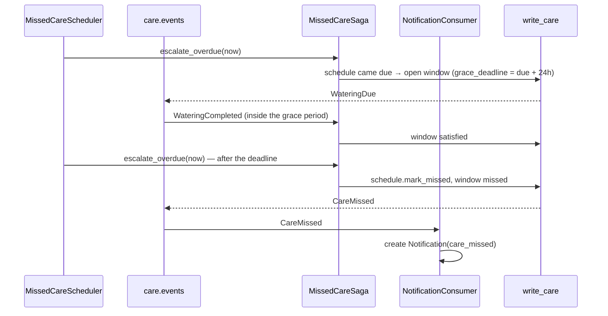
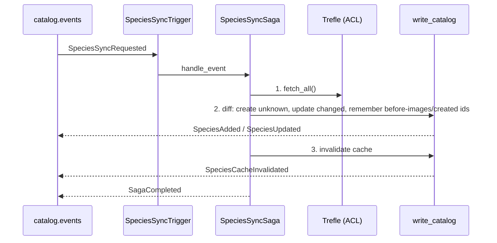

# Sagas

> **Status:** the four process managers run in `apps/workers` (`make workers`),
> alongside the outbox relay. The architectural decision behind their two shapes is
> [ADR 0005](adr/0005-orchestration-vs-choreography.md); their real step sequences are
> generated into [`docs/diagrams/sagas.md`](diagrams/sagas.md) by `make diagrams`.

A *saga* here is a long-running reaction to domain events: it spans several
transactions, several aggregates, and sometimes a wall-clock delay. This document
describes the four the project ships, how they are wired, and how to run, observe
and recover them.

## Two shapes

| Shape | The saga owns | Where it lives | Sagas |
|-------|---------------|----------------|-------|
| **Orchestration** | An ordered list of steps and their compensations | `Saga` + `SagaStepHandler` subclasses, executed by the cqrs engine | `OnboardPlantSaga`, `SpeciesSyncSaga` |
| **Choreography** | Nothing but its reaction | A `Consumer` subclass, one handler chain per topic | `AdaptiveWateringSaga`, `MissedCareSaga` |

An orchestration saga keeps its progress in `write_shared.saga_state` and its step
history in `write_shared.saga_log`. A choreography saga keeps only the state its
reaction genuinely needs — for the missed-care grace period, that is a row in
`write_care.missed_care_windows`.

## Wiring

```
POST /api/v1/plants ──► outbox ──► relay ──► garden.events ──► OnboardPlantTrigger
                                                                     │
                                                          OnboardPlantSaga (4 steps)
                                                                     │
                                            write_shared.saga_intents + outbox
                                                                     │
                                                          CommandDispatcher
                                                                     │
                                             write_care + write_notifications + outbox
```

Every consumer subscribes with a group of its own
(`<WORKER_CONSUMER_GROUP_PREFIX>-onboard-plant`, `…-adaptive-watering`,
`…-missed-care`, `…-species-sync`) and `auto_offset_reset="earliest"`. Before it
does any work it claims `(consumer_group, event_id)` in
`write_shared.processed_events`; the claim commits with the work, so a redelivery
is a no-op. A handler failure that rolls back releases the claim and the retry
starts from nothing — with one exception: when an orchestration saga fails, its
`SagaFailed` record is committed and takes the claim with it, so the redelivery is
again a no-op and the `failed` saga is left for an operator (see *Known
limitations* below).

**A saga writes the way the API does, not through the API.** Its steps are plain
application-layer handlers, so a step that changes the domain goes through the same
`UnitOfWork` as an HTTP command — repositories over the request's session, one commit —
and the events it produces land in the outbox of that commit, which the relay then
publishes. There is no command port and no round trip through `make api`: the
orchestration sagas run inside the `make workers` process and share the application
layer with the API, which is the design [ADR 0005](adr/0005-orchestration-vs-choreography.md)
chose. What a saga *does* own separately is its own progress: `SagaStarted`,
`SagaCompleted`, `SagaFailed` and `SagaCompensated` go to the outbox like any other
event, while the engine's execution row and step log are committed by the saga storage
**in the step's own transaction** — see *One transaction per step* below.

No consumer writes another context's tables. A saga step that changes a context the
process does not own **records a command** in `write_shared.saga_intents`, in the same
transaction as its own checkpoint, and the command dispatcher runs it afterwards through
the owning context's handler and unit of work ([ADR 0012](adr/0012-saga-command-dispatch.md)).
A step that changes a context the process *does* own commits it directly, the way a
command does.

No consumer reads another context's tables either. A consumer that needs a durable
reference to another context's aggregate keeps a row of its own, filled from that
context's events under its own consumer group: the notification and journal consumers
each hold a plant reference (`write_notifications.plant_refs`, `write_journal.plant_refs`)
maintained from `PlantAdded`/`PlantMoved`/`PlantRemoved`, and resolve a `plant_id` from
it — a fact for a plant this context has not seen is dropped, because there is no
household to address or record it against
(`plantkeeper.application.references`). The one read a process makes through another
context's port is the onboarding saga's species lookup: `ResolveSpeciesStep` asks the
catalogue through `SpeciesCatalog`, a local read of the catalogue the Catalog context
owns rather than a call into its code — the ACL
[ADR 0005](adr/0005-orchestration-vs-choreography.md) chose, described in
[`docs/catalog.md`](catalog.md).

## OnboardPlantSaga — orchestration

Trigger: `PlantAdded`. Deterministic id: `uuid5("OnboardPlantSaga:<plant_id>")`.


```mermaid
sequenceDiagram
    participant K as garden.events
    participant T as OnboardPlantTrigger
    participant S as OnboardPlantSaga
    participant C as Catalog
    participant W as write side
    participant O as outbox
    participant D as CommandDispatcher
    participant Cr as care context
    participant N as notifications context

    K->>T: PlantAdded
    T->>S: handle_event
    S->>O: SagaStarted
    S->>C: 1. resolve species
    S->>W: 2. record CreateCareScheduleCommand
    S->>W: 3. record CreateOnboardingNotificationCommand
    S->>W: 4. append PlantOnboarded
    S->>O: SagaCompleted
    O-->>D: (the intents are claimed by the dispatcher)
    D->>Cr: CreateCareScheduleCommand
    Cr->>O: CareScheduleCreated
    D->>N: CreateOnboardingNotificationCommand
    N->>O: NotificationCreated
    O-->>S: (every event published by the relay)
```

| Step | Writes | Compensation |
|------|--------|--------------|
| 1. `ResolveSpeciesStep` | nothing | nothing |
| 2. `CreateCareScheduleStep` | `write_shared.saga_intents` | cancel the intent, or record `DeleteCareScheduleCommand` |
| 3. `CreateOnboardingNotificationStep` | `write_shared.saga_intents` | cancel the intent, or record `DeleteNotificationCommand` |
| 4. `PublishPlantOnboardedStep` | outbox | none — a published event cannot be unpublished |

Steps 2 and 3 write no other context's table. They record a command in their own
transaction — the same transaction as the step's checkpoint — and the dispatcher
executes it afterwards through the owning context's own handler and unit of work, so
`write_care` and `write_notifications` still have exactly one writer each
([ADR 0012](adr/0012-saga-command-dispatch.md)).

Compensation prefers **cancelling** a recorded command to undoing it: an intent the
dispatcher has not run yet can simply be withdrawn, so the effect never happens.
Once it has run, the only honest rollback is another recorded command, issued to the
same context through the same hand-off — which is why the care and notification
contexts each own a delete command.

Each step still commits its own transaction, so a failure in step 3 compensates step
2 in a fresh transaction, and the saga ends `failed` with `SagaFailed` +
`SagaCompensated` on `saga.events` — unless a retry under the budget gets it
through.

## AdaptiveWateringSaga — choreography

Trigger: `TelemetryReceived`, `SoilMoistureHigh` (topic `telemetry.events`).


```mermaid
sequenceDiagram
    participant K as telemetry.events
    participant S as AdaptiveWateringSaga
    participant W as write_care

    K->>S: TelemetryReceived
    alt moisture < 30% and next watering > 2 days away
        S->>W: reschedule to now
        W-->>K: WateringRescheduled
    end
    K->>S: SoilMoistureHigh
    alt no unread overwatering reminder for this plant
        S->>W: create Notification(soil_moisture_high)
    end
```

`WATERING_HORIZON` (2 days) and `MOISTURE_LOW_THRESHOLD` come from one place each:
the horizon is the saga's own constant, the threshold is
`plantkeeper.domain.telemetry.sensor`'s, so telemetry and its consumer cannot
disagree about what "dry" means. Pulling the schedule to *now* is what stops a
10-second telemetry stream from becoming an event storm: the condition no longer
holds on the next reading. The overwatering reminder is deduplicated against the
household's **unread** notifications, so a sensor that reports 95% all afternoon
produces one message.

## MissedCareSaga — choreography with a timer

Trigger: `WateringDue`, `WateringCompleted` (topic `care.events`), plus
`MissedCareScheduler` in the worker.


```mermaid
sequenceDiagram
    participant S as MissedCareScheduler
    participant K as care.events
    participant M as MissedCareSaga
    participant N as NotificationConsumer
    participant W as write_care

    S->>M: escalate_overdue(now)
    M->>W: schedule came due → open window (grace_deadline = due + 24h)
    W-->>K: WateringDue
    K->>M: WateringCompleted (inside the grace period)
    M->>W: window satisfied
    S->>M: escalate_overdue(now) — after the deadline
    M->>W: schedule.mark_missed, window missed
    W-->>K: CareMissed
    K->>N: CareMissed
    N->>N: create Notification(care_missed)
```

| Event | State change |
|-------|--------------|
| `WateringDue` | upsert `MissedCareWindow(pending, grace_deadline = due_at + 24h)` |
| `WateringCompleted` | `pending → satisfied`, if the watering was inside the grace period |
| scheduler tick | open windows for newly due schedules; for expired pending windows: `mark_missed` (shifts the schedule), `pending → missed` |

The `care_missed` reminder is `NotificationConsumer`'s ([`docs/notifications.md`](notifications.md)),
not this saga's: the saga owns the schedule and the window, and the Notifications
context owns what the household sees. It reacts to the `CareMissed` recorded on the
tick.

The anti-join in `list_due_without_pending_window` is what makes the tick
idempotent: once a window is open, the schedule stops being "newly due", so a tick
every minute records one `WateringDue`, not one per minute. A watering that
arrives *after* the deadline does not erase the miss.

## SpeciesSyncSaga — orchestration

Trigger: `SpeciesSyncRequested` (topic `catalog.events`), published by both the
manual `POST /api/v1/catalog/sync` and the daily `SpeciesSyncScheduler`.
Deterministic id: `uuid5("SpeciesSyncSaga:<trigger event_id>")` — one saga per
request.


```mermaid
sequenceDiagram
    participant K as catalog.events
    participant T as SpeciesSyncTrigger
    participant S as SpeciesSyncSaga
    participant U as Trefle (ACL)
    participant W as write_catalog

    K->>T: SpeciesSyncRequested
    T->>S: handle_event
    S->>U: 1. fetch_all()
    S->>W: 2. diff: create unknown, update changed, remember before-images/created ids
    W-->>K: SpeciesAdded / SpeciesUpdated
    S->>W: 3. invalidate cache
    W-->>K: SpeciesCacheInvalidated
    S-->>K: SagaCompleted
```

| Step | Writes | Compensation |
|------|--------|--------------|
| 1. `FetchSpeciesStep` | nothing | nothing |
| 2. `ApplySpeciesUpdatesStep` | `write_catalog.species` | delete every created id, restore every before-image |
| 3. `InvalidateSpeciesCacheStep` | outbox (`SpeciesCacheInvalidated`) | nothing local to undo |

Step 3 exists so that step 2 can *fail after committing* — which is exactly the
case compensation is for. The restore goes through `Species.update`, so it records
a `SpeciesUpdated` of its own: a rollback is a catalogue change its consumers must
see, not a silent rewrite. An upstream species the local catalogue does not know
is created with `Species.add`, which records `SpeciesAdded`; the compensation
deletes it again. Species that vanished upstream are left alone — Trefle has no
"species gone" signal. See [`docs/catalog.md`](catalog.md) for the Trefle
contract, the mapping and the cache.

## Idempotency, recovery and observability

- **Idempotency.** Redelivery is stopped by the `processed_events` claim; a
  replay from a fresh consumer group is stopped by the saga's deterministic id and
  the engine's *already completed* check. Both are exercised by tests.
- **Recovery and retry.** `SagaRecoveryJob` polls `saga_state` for two different
  kinds of unfinished process, both untouched for `SAGA_RECOVERY_STALE_AFTER_SECONDS`:
  a **crashed** one (`running`/`compensating`) is resumed from its step history, and
  a **failed** one is retried. A retry runs the process forward again — the engine
  refuses to do that while the status says `failed`, so the status is cleared for
  the attempt — and its budget is the same `recovery_attempts` counter a crash-loop
  spends, capped by `SAGA_RECOVERY_MAX_ATTEMPTS`. Past the budget the process is
  **parked**: `SagaParked` is published, and nothing runs it again until an
  operator does. The job asks the storage for one attempt *more* than the budget
  for exactly this reason: the query returns processes strictly below the limit it
  is given, so a budget-sized limit would hide the process that had just spent its
  budget and nothing would ever be parked. The park spends that extra attempt, in
  the same transaction as the event, so the decision and the record of it cannot
  come apart — and the announcement happens once, not on every tick.
- **Resetting a parked process.** An operator clears the parked state with
  `SqlAlchemySagaStorage.reset_for_retry(saga_id)`, which zeroes the counter *and*
  the status: zeroing only the counter would let the next tick park it again
  immediately, and clearing only the status would leave it over budget. The job's
  next tick then resumes it from the recorded step history.
- **Lifecycle events.** `SagaStarted`, `SagaCompleted`, `SagaFailed`,
  `SagaCompensated`, `SagaRetrying` and `SagaParked` travel on `saga.events`, keyed
  by `saga_id`, so one saga's lifecycle messages stay in one partition and in
  order.
- **Inspecting a saga**

  ```sql
  SELECT id, name, status, version, recovery_attempts, created_at, updated_at
    FROM write_shared.saga_state ORDER BY updated_at DESC;

  SELECT step_name, action, status, details, created_at
    FROM write_shared.saga_log WHERE saga_id = $1 ORDER BY created_at, id;

  SELECT consumer_group, event_id, processed_at
    FROM write_shared.processed_events
   WHERE consumer_group = 'plantkeeper-worker-onboard-plant'
   ORDER BY processed_at DESC LIMIT 20;
  ```

## One transaction per step

The engine commits at every step boundary, and those commits are the request's.
`SqlAlchemySagaStorage` is built per request with the request's own session and the
unit of work that commits it (`SagaProvider.request_saga_storage`), so one step's

```
  step's effect  +  its saga_log entry  +  its saga_state checkpoint  +  its lifecycle outbox row
  -----------------------------------------------------------------------------------------------
                              ONE commit
```

becomes durable together, or none of it does. The checkpoint travels through the unit
of work rather than the raw session, so the events the step's aggregate raised are
drained into the outbox on the way past — committing the session directly would leave
them unappended.

Two consequences worth knowing:

- **A step that fails leaves nothing.** The engine has no rollback on its failure path,
  so a run that sees a failed step discards that transaction instead of committing it
  (the half-written work a step staged but never committed would otherwise survive).
  The saga's failure is still recorded: `Saga._record_failure` commits `SagaFailed`
  afterwards, and that event carries the error.
- **`SagaStarted` commits before the engine opens its run.** The engine's first act is to
  roll the session back when it cannot find the saga, which would take an uncommitted
  `SagaStarted` with it; the saga would then announce that it started only if it
  succeeded.

`SagaRecoveryJob` gets the *unbound* storage instead — each run opens and commits a
session of its own — because a background tick has no request scope and therefore no
unit of work to commit into.

## Running it

`make workers` runs the whole write-side back end in one process: the outbox relay, the
eight write-side consumer groups (the two orchestration triggers and the six
choreography consumers), the telemetry ingress on `telemetry.raw`, the
`CommandDispatcher` that executes the sagas' recorded cross-context commands, and the
five timers — the missed-care tick, the daily catalogue trigger, the saga recovery job,
the readings table's partition window and retention, and the sensor silence timer.
Relevant settings (see `.env.example`):

| Setting | Default | Meaning |
|---------|---------|---------|
| `WORKER_CONSUMER_GROUP_PREFIX` | `plantkeeper-worker` | group prefix for every saga consumer |
| `CONSUMER_MAX_ATTEMPTS` | `3` | delivery attempts (with backoff) before a consumer moves one aside |
| `CONSUMER_RETRY_INITIAL_WAIT_SECONDS` | `0.5` | wait after the first failed attempt, doubling each time |
| `CONSUMER_RETRY_MAX_WAIT_SECONDS` | `10` | ceiling on that wait |
| `MISSED_CARE_CHECK_INTERVAL_SECONDS` | `60` | how often the grace-period tick runs |
| `SPECIES_SYNC_INTERVAL_SECONDS` | `86400` | how often the daily sync is requested |
| `SAGA_RECOVERY_INTERVAL_SECONDS` | `30` | how often crashed sagas are looked for |
| `SAGA_RECOVERY_MAX_ATTEMPTS` | `5` | failed recoveries before a saga is left alone |
| `SAGA_RECOVERY_STALE_AFTER_SECONDS` | `60` | age before a running saga is considered crashed |

The three `CONSUMER_*` settings belong to the platform's consumer failure policy, which
every subscriber shares ([ADR 0011](adr/0011-consumer-failure-policy.md)); they are
listed here because this is the process that runs most of those subscribers.

## Known limitations

- A recorded saga failure is retried, then parked. `SagaFailed` is still committed
  from the same transaction as the delivery's `processed_events` claim, so the
  *redelivery* stops at the claim — but the retry no longer depends on redelivery:
  `SagaRecoveryJob` picks the `failed` row up itself, within the budget, and parks
  the process once the budget is spent. Nothing runs a parked process again but
  `reset_for_retry`.
- A **retried** process re-runs from its step history, so every step has to be safe
  to run again. The delegated commands are (their idempotency key is derived from
  the saga and the step), and the recorded-command table is what makes that true;
  a step that appends an event to the outbox directly would append it twice.
- A parked process is visible only through `write_shared.saga_state`, the
  `SagaParked` event and the intent table. There is no operator command for
  resetting one yet — `reset_for_retry` is a method, not a CLI entry point.
- Compensating a step that published an event cannot recall the message. The
  onboarding sequence publishes last for that reason; a compensated onboarding can
  leave a stale read-side care row until the read model is rebuilt
  (`docs/cqrs.md`).
- `SpeciesSyncSaga` never deletes a local species: Trefle has no "species gone"
  signal, so local entries outlive an upstream removal (`docs/catalog.md`).
- The compensation of a catalogue creation deletes the write-side row, but the
  `SpeciesAdded` it published cannot be recalled — the same case as
  `PlantOnboarded` above.
- `SagaStateRepository` has no production caller: recovery goes through the
  library's `ISagaStorage.get_sagas_for_recovery`, which answers ids only. The
  repository is a reading facade over the same table and is covered by an
  integration test.
