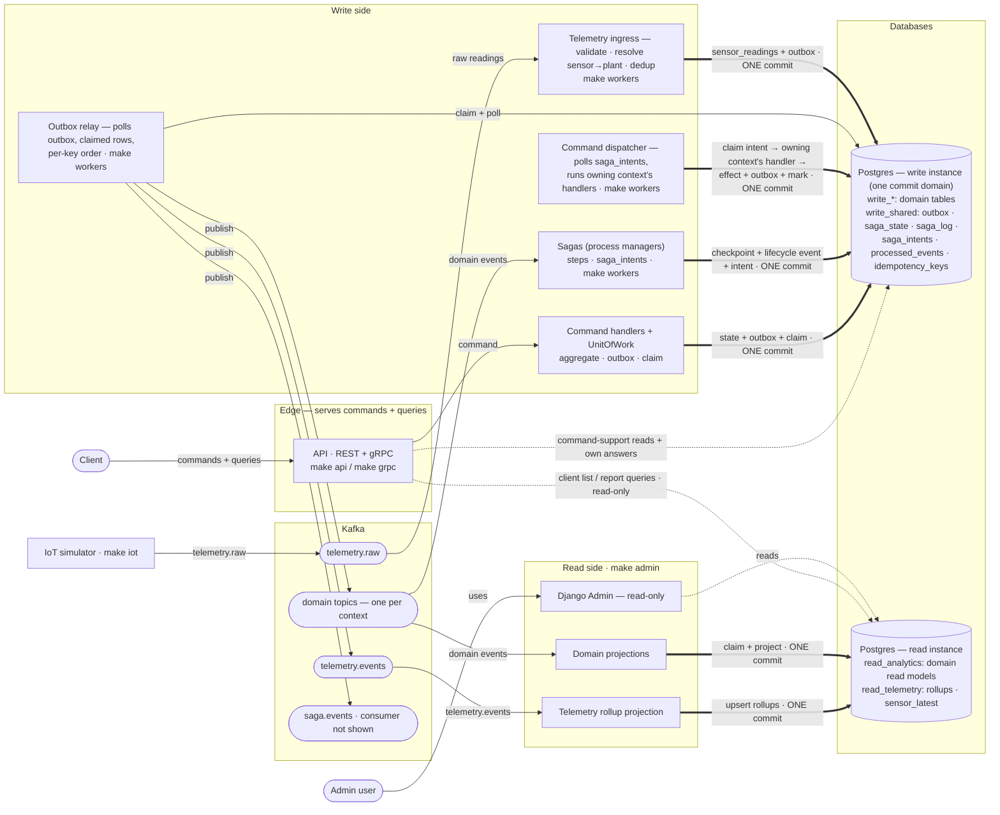

# Design

## Context

The write side runs on one Postgres that holds the `write_*` schemas and `write_shared`
(outbox, `saga_state`, `saga_log`, `processed_events`, `idempotency_keys`); the read side
holds `read_analytics` in the same instance and is Django-owned. Orchestration sagas run
on `python-cqrs`'s engine, which commits `saga_state`/`saga_log` in sessions of its own
while step writes commit through the request's `UnitOfWork`. The outbox relay polls with
`fetch_unpublished` (no row locking) and publishes each row independently. Consumers get
no terminal failure path: a raising handler propagates and the broker redelivers. Telemetry
flows `telemetry.raw → telemetry.events` and stops there; `Sensor.last_seen_at` is not
persisted. The event envelope is `event_id`/`occurred_at` plus `event_name`/`event_id`
headers. See `proposal.md` for why each of these is being changed.

Target topology after the change (write instance and read instance separated, saga
effects recorded as commands, telemetry entering through the write-side ingress and
projected from `telemetry.events`). Thick arrows are the writes that commit in a single
transaction, dotted arrows are reads, plain arrows are message flow and relay claims:

## Goals / Non-Goals

**Goals:**

- No window in which a saga's recorded progress and its effects can disagree.
- Exactly-once execution per recorded cross-context command, without a synchronous call
  between contexts.
- A relay that can run more than once and still publishes a key in order.
- A terminal path for deliveries that cannot be handled, and a bounded retry for the rest.
- A query path for telemetry and for client-facing lists that does not touch the write side.
- Provenance and versioning on every message, without changing what a message body is.

**Non-Goals:**

- Authentication or authorization of any kind (forbidden by `developer-workflow` and
  AGENTS.md; this change only makes the envelope able to name an actor).
- A new broker, queue, task runner, or a second message transport.
- Event-sourcing more aggregates; replacing `python-cqrs`; changing topic layout.
- Exactly-once end-to-end delivery — the platform stays at-least-once with idempotent
  consumers.
- Read-side UI work beyond what the new read models need to be inspectable.

## Decisions

### 1. A step's transaction carries its checkpoint and its lifecycle event

`SqlAlchemySagaStorage` gains a run bound to the caller's `UnitOfWork` session, so
everything one step records commits in one transaction: its own-context write (when it has
one), its `saga_log` entry, its `saga_state` checkpoint, its lifecycle outbox row and —
when the step changes another context — the recorded command instead of the write (see
decision 2). Per-step commits stay (compensation needs durable steps); only the
*checkpoint* moves into the step's transaction.

- *Why:* the saga tables and the outbox already share one Postgres; the dual write was
  self-inflicted. One commit closes the crash window without changing the step model.
- *Alternatives:* keeping the engine's own sessions and leaning on idempotent steps
  (rejected: correctness by convention, breaks on non-idempotent steps like the Trefle
  fetch); event-sourcing the saga (rejected: heavy, and `saga_log` already is a small
  event log); moving `saga_state`/`outbox` into a database of their own (rejected: it
  splits the commit domain — the step's write and its checkpoint would become two commits
  in two databases, which is the dual write this decision exists to remove).

### 2. Cross-context effects are recorded commands, executed by a dispatcher

A step that changes a context the saga does not own inserts a row into
`write_shared.saga_intents (saga_id, step_no, command_name, payload, status, attempts,
claimed_at)` **in the step's own transaction**; a new `…-command-dispatcher` consumer
claims pending intents (`FOR UPDATE SKIP LOCKED`), resolves the owning context's command
handler, and marks the intent executed in the same transaction as the handler's write and
its outbox rows. The saga therefore never writes another context's tables and never calls
another context synchronously.

- *Why:* this is the transactional outbox applied inside the saga — dispatch is a property
  of the transaction, not of a lucky crash-free run. It also removes the last in-process
  cross-context write, so the README's "events between contexts" claim becomes true.
- *Alternatives:* Kafka command topics (rejected: commands are a context's private
  vocabulary, not a public contract; it would double the topic surface and re-add ordering
  problems, and command messages on the broker would break the platform's "every message
  on Kafka is a domain event" contract that the generated catalogue guards — a
  `K → command handler` edge is not a real path, since a dispatcher *consumer* owns
  execution); keeping direct handler calls (rejected: that is the violation being fixed).

### 3. A recorded saga failure is retried within a budget, then parked

The `failed` status splits into `failed` (retryable, budget = the existing
`recovery_attempts` counter) and `parked` (budget exhausted, operator only). Recovery
re-runs `failed` rows as it already re-runs `running` ones; an operator reset zeroes the
counter and clears the status. `SagaFailed` is published per attempt; `SagaParked` is
published when the budget is exhausted.

- *Why:* "a recorded failure is final" converts a transient fault into permanent silence.
- *Alternatives:* infinite retry (rejected: a poison saga would loop forever); operator-only
  (status quo, rejected: no tooling exists and humans are not a retry policy).

### 4. Provenance and versioning travel in headers, body stays the event

`correlation_id`, `causation_id`, `raised_by`, `schema_version` and W3C `traceparent` are
added as message headers (and outbox columns) by the components that append to the outbox;
consumers propagate them onto the events they raise. `raised_by` is a small tagged string
(`user:<id>`, `system:<job>`, `saga:<id>`, `service:<name>`). `schema_version` starts at
`1` for every existing event and is bumped only for incompatible payload changes.

- *Why:* the body-is-the-event contract (`event-transport`) stays intact and existing
  consumers keep working; headers are where a broker-level concern like tracing belongs.
- *Alternatives:* a body envelope (rejected: breaks the documented contract and every
  `extra="forbid"` model); putting provenance in the payload (rejected: it is transport
  metadata, and it would make every event model's `extra="forbid"` a migration hazard).

### 5. The relay claims rows and holds a key back on failure

`fetch_unpublished` becomes `FOR UPDATE SKIP LOCKED` over rows whose lease (`claimed_at`)
is absent or stale, so several relays can run at once. A row is published only when no
older row with the same `partition_key` is still unpublished; a publish failure therefore
holds back the later rows of its key (the ordering barrier) while other keys proceed.

- *Why:* the partition-key contract promises in-order delivery per aggregate; today one
  failed row lets its successors overtake it. Claiming removes the double-publish race
  between overlapping relays during deploys.
- *Alternatives:* one relay with a documented limitation (rejected: deploys overlap);
  Kafka idempotent producer or transactions (rejected: ordering is lost in the relay, not
  in the broker).

### 6. Consumers distinguish terminal from transient failures

The consumer wrapper classifies failures: a `DomainError` is terminal and is moved aside
immediately; anything else is retried a bounded number of times with backoff and then moved
aside. A moved-aside delivery is copied to `plantkeeper.dlq.v1` with its consumer group,
original topic and error in headers, and its `processed_events` claim is committed with the
copy so it is never handled twice.

- *Why:* the gap `event-transport` records today ("the error propagates and the broker
  redelivers it") means one poison delivery can stall a partition and a transient failure
  has no backoff.
- *Alternatives:* FastStream's built-in retry alone (rejected: no terminal path, no ledger
  claim, no DLQ record); dropping failing deliveries (rejected: silent data loss).

### 7. Cross-context references are event-maintained rows

The notification and journal consumers stop resolving `plant_id` from `write_garden`.
Each consuming context keeps a small reference table of its own (e.g.
`write_notifications.plant_refs`), upserted from `PlantAdded`/`PlantRemoved` under its own
consumer group. One writer per table, like the read models.

- *Why:* reading another context's tables is the coupling `event-transport` forbids; a
  reference row per context keeps each schema self-contained.
- *Alternatives:* a shared read of `write_garden` (status quo, rejected); a shared kernel
  table of identifiers (rejected: it is a shared database under another name).

### 8. Telemetry gets its own read side, and raw readings a retention window

`read_telemetry` (Django migrations, read instance) holds `telemetry_rollups`
(`sensor_id`, `bucket_start`, min/avg/max moisture, min/avg/max temperature, sample count,
upserted `ON CONFLICT (sensor_id, bucket_start)`) and `sensor_latest`. A
`…-telemetry-rollup` projection consumes `telemetry.events` with its own group and ledger.
The existing partition job also drops raw partitions older than the retention window.

- *Why:* rollups answer "how has this plant been doing" in one read and outlive the raw
  rows; keeping them out of `read_analytics` leaves the domain read models' shape, one-writer
  rule and rebuild story untouched.
- *Alternatives:* projecting raw rows into the read side (rejected: volume, no query needs
  every reading); projecting `telemetry.raw` straight into the read instance (rejected: a
  raw reading carries no plant identifier and no event identifier — the read side would
  have to duplicate the ingress's validation, sensor resolution and deduplication, would
  become a second writer of the same facts, and would copy raw rows into read models the
  specs keep them out of); TimescaleDB/ClickHouse (rejected: new infrastructure for a
  demo-scale stream, and month partitions already work).

### 9. A silent sensor is announced once per silence

`sensors.last_seen_at` becomes a persisted column updated with each stored reading, and a
`SensorSilenceJob` timer (alongside the missed-care tick) publishes `SensorOffline` for a
sensor silent longer than the configured period and not yet announced for this silence
(`offline_announced_at` resets on the next reading). The notification consumer creates the
`sensor_offline` reminder from it like any other telemetry fact.

- *Why:* the event is already in the catalogue; persisting last-seen and adding the timer
  is the whole gap between promise and behaviour.

### 10. Client list/report queries read the read instance

A `ReadModelReader` port (read-only SQLAlchemy engine against the read instance) serves
the list/report query handlers; the response to a command and the reads a command needs
stay on the write side. The API process opens a second, read-only engine — no call to the
admin process, and the API still never touches the broker.

- *Why:* this is the CQRS split the README claims: one truth per question, reads scale with
  the read instance, and the write instance stops paying for admin-shaped queries and
  journal replays.
- *Alternatives:* proxying to the admin process over HTTP (rejected: a synchronous call
  between deployables); keeping all API reads on the write side (status quo, rejected:
  two different answers to the same question).

### 11. SSE over the existing nudge channel; long polling stays as fallback

`GET /api/v1/notifications/stream` streams `text/event-stream`, woken by the same
payload-free Valkey household channel the long poll uses, re-reading the database on each
nudge and resuming from a `since` cursor (notification ids are UUIDv7, so monotonic). The
stream holds a Valkey subscription but no database session while idle, and one subscriber
per household fans out to that household's open streams. The request/wait endpoint is kept
unchanged as the fallback form.

- *Why:* the nudge pattern is already correct for push; SSE gives it a push-shaped wire
  format with resumability, no session-per-waiter, and no broker access from the API.
- *Alternatives:* WebSockets (rejected: no duplex traffic to justify it); consuming
  `notifications.events` inside the API (rejected: the API would stop being broker-free);
  APNs/FCM (rejected: no device identity without auth, out of scope).

### 12. The read instance is a second Postgres in compose, switched by configuration

`docker-compose.yml` runs a second Postgres for `read_analytics` + `read_telemetry` + the
Django `public` tables; both are addressed by URL settings, so pointing the read side back
at the write instance is a configuration change and the whole split is reversible. Two
instances, three schemas: `write_shared` stays a schema of the write instance.

- *Alternatives:* a third "shared" instance for `outbox`/`saga_state` (rejected: it breaks
  the single commit domain that the outbox and the saga checkpoint depend on — see
  decision 1); one instance for everything (rejected in production because projection
  rebuilds and admin queries compete with the write path, and kept only as a dev fallback
  where both URLs point at one instance).

## Risks / Trade-offs

- [Recorded commands make cross-context effects asynchronous] → onboarding's notification
  and schedule appear one dispatcher cycle later; end-to-end tests assert the eventual
  effects and the dispatcher's latency is bounded by its poll interval.
- [The ordering barrier can hold a key back behind one failing row] → other keys proceed;
  the outbox depth metric and the attempts column make a stuck key visible, and the
  abandon threshold frees the key in bounded time.
- [Two databases raise local resource use] → both are Alpine images with small pools; the
  read instance is optional in dev (both URLs may point at one instance).
- [Retryable failures can re-run a poisoned saga up to its budget] → the budget is small,
  each attempt is recorded, and the parked state is explicit and operator-visible.
- [Headers-only provenance means old messages lack it] → consumers treat absent headers as
  unknown origin rather than failing; no consumer requires the new headers to exist yet.
- [The read models are read by two ORMs (Django writes, SQLAlchemy reads)] → the SQLAlchemy
  mappings are read-only and declared beside the Django models, and a parity test fails when
  the two disagree on a column.
- [SSE adds long-lived connections to the API process] → per-household fanout bounds
  subscriptions to one per household, and an idle stream holds no database session.

## Migration Plan

Ordered so each step is independently deployable and reversible:

1. **Envelope + outbox columns** (additive migration; producers fill the new headers,
   consumers tolerate their absence).
2. **Relay claiming and the ordering barrier** (no data migration; safe with one relay).
3. **`saga_intents` + dispatcher + retryable failures** (one migration; deploy workers
   before triggers depend on intents).
4. **Read instance split** (compose + settings; switch the read side's URL first, then the
   API's read engine; rollback is reverting the URLs).
5. **Telemetry rollups, retention and the silence timer** (independent of 4's switch).
6. **SSE endpoint** (independent; long-poll endpoint remains).
7. **Docs, diagrams and ADRs** once behaviour matches: README and `docs/architecture.md`
   claims, `docs/events.md` envelope, `docs/cqrs.md`/`docs/sagas.md`/`docs/notifications.md`/
   `docs/telemetry.md`, one ADR for saga command dispatch and one for the trust model,
   regenerated contracts and diagrams.

Rollback: every migration is additive; the intent dispatcher ignores rows it cannot
resolve and parks them; the read split reverts by configuration.

## Open Questions

None that would change the specs, the approach, or the task breakdown.
